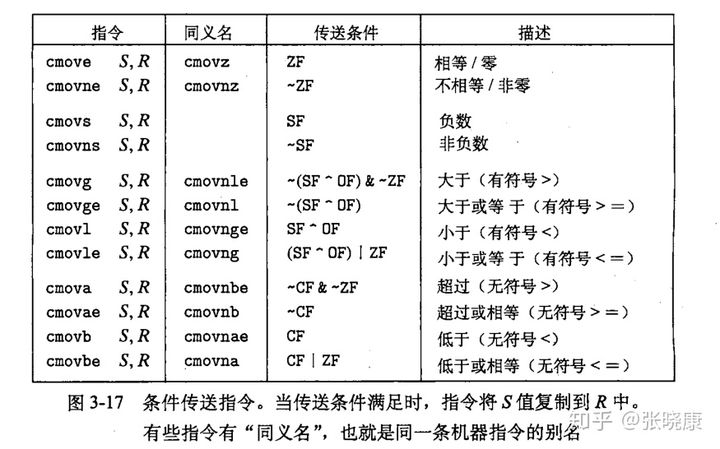

# Activity 2: Machine control 记录

- [Activity 2: Machine control 记录](#activity-2-machine-control-记录)
  - [Basic Control Flow](#basic-control-flow)
  - [Comparisons and Conditional Set Instructions](#comparisons-and-conditional-set-instructions)
  - [Tests and Conditional Move Instructions](#tests-and-conditional-move-instructions)
  - [Loops](#loops)
  - [Switch Statements](#switch-statements)

## Basic Control Flow

首先回答 Q1：为什么 JZ 和 JE 指令相同？
对于 JZ，即 jump if zero，在跳转之前，我们首先需要将其与 0 做差，判断结果的 ZF 是否等于 1。对于 JE，我们首先将两数做差（也可以使用`testq`指令？），然后判断 ZF 是否等于 1。JZ 和 JE 都是对 ZF 进行判断，然后进行跳转。

然后我们回答 Q2：首先阅读`jumps.S`。我们发现`jumps.S`就是以`jump_insns`开头的一群跳转指令的集合。然后我们输入如下指令：

```bash
$ as jumps.S -o jumps.o
$ objdump -d jumps.o

```

其结果如下：

```asm

jumps.o:     file format elf64-x86-64


Disassembly of section .text:

0000000000000000 <jump_insns>:
   0:   eb 34                   jmp    36 <destination>
   2:   70 32                   jo     36 <destination>
   4:   71 30                   jno    36 <destination>
   6:   72 2e                   jb     36 <destination>
   8:   72 2c                   jb     36 <destination>
   a:   72 2a                   jb     36 <destination>
   c:   73 28                   jae    36 <destination>
   e:   73 26                   jae    36 <destination>
  10:   73 24                   jae    36 <destination>
  12:   74 22                   je     36 <destination>
  14:   74 20                   je     36 <destination>
  16:   75 1e                   jne    36 <destination>
  18:   75 1c                   jne    36 <destination>
  1a:   76 1a                   jbe    36 <destination>
  1c:   76 18                   jbe    36 <destination>
  1e:   77 16                   ja     36 <destination>
  20:   77 14                   ja     36 <destination>
  22:   78 12                   js     36 <destination>
  24:   79 10                   jns    36 <destination>
  26:   7c 0e                   jl     36 <destination>
  28:   7c 0c                   jl     36 <destination>
  2a:   7d 0a                   jge    36 <destination>
  2c:   7d 08                   jge    36 <destination>
  2e:   7e 06                   jle    36 <destination>
  30:   7e 04                   jle    36 <destination>
  32:   7f 02                   jg     36 <destination>
  34:   7f 00                   jg     36 <destination>

0000000000000036 <destination>:
  36:   c3                      retq
```

这些指令的共同点就是都跳转到地址为 36 的`destination`处。此外，每个跳转指令的编码都是 2 个字节，第二个字节的值即为跳转的相对偏移地址，其值 = 目的地址 - 下一套指令的地址（因为执行到这里的时候 PC 已经指向下一条了），所以需要将该值增加到 PC 中，然后进行跳转。

接下来我们将`.skip 97`一行注释掉，然后再编译并且反汇编看看：

```

jumps.o:     file format elf64-x86-64


Disassembly of section .text:

0000000000000000 <jump_insns>:
   0:   e9 bd 00 00 00          jmpq   c2 <destination>
   5:   0f 80 b7 00 00 00       jo     c2 <destination>
   b:   0f 81 b1 00 00 00       jno    c2 <destination>
  11:   0f 82 ab 00 00 00       jb     c2 <destination>
  17:   0f 82 a5 00 00 00       jb     c2 <destination>
  1d:   0f 82 9f 00 00 00       jb     c2 <destination>
  23:   0f 83 99 00 00 00       jae    c2 <destination>
  29:   0f 83 93 00 00 00       jae    c2 <destination>
  2f:   0f 83 8d 00 00 00       jae    c2 <destination>
  35:   0f 84 87 00 00 00       je     c2 <destination>
  3b:   0f 84 81 00 00 00       je     c2 <destination>
  41:   75 7f                   jne    c2 <destination>
  43:   75 7d                   jne    c2 <destination>
  45:   76 7b                   jbe    c2 <destination>
  47:   76 79                   jbe    c2 <destination>
  49:   77 77                   ja     c2 <destination>
  4b:   77 75                   ja     c2 <destination>
  4d:   78 73                   js     c2 <destination>
  4f:   79 71                   jns    c2 <destination>
  51:   7c 6f                   jl     c2 <destination>
  53:   7c 6d                   jl     c2 <destination>
  55:   7d 6b                   jge    c2 <destination>
  57:   7d 69                   jge    c2 <destination>
  59:   7e 67                   jle    c2 <destination>
  5b:   7e 65                   jle    c2 <destination>
  5d:   7f 63                   jg     c2 <destination>
  5f:   7f 61                   jg     c2 <destination>
        ...

00000000000000c2 <destination>:
  c2:   c3                      retq
```

[Oracle 的 x86 Assembly Language Reference Manual ](https://docs.oracle.com/cd/E26502_01/html/E28388/eoiyg.html)中写道：

> .skip integer, value
>
> While generating values for any data section, the .skip directive causes integer bytes to be skipped over, or, optionally, filled with the specified value.

将 97 改为 98，再次处理后查看：

```

jumps.o:     file format elf64-x86-64


Disassembly of section .text:

0000000000000000 <jump_insns>:
   0:   e9 c2 00 00 00          jmpq   c7 <destination>
   5:   0f 80 bc 00 00 00       jo     c7 <destination>
   b:   0f 81 b6 00 00 00       jno    c7 <destination>
  11:   0f 82 b0 00 00 00       jb     c7 <destination>
  17:   0f 82 aa 00 00 00       jb     c7 <destination>
  1d:   0f 82 a4 00 00 00       jb     c7 <destination>
  23:   0f 83 9e 00 00 00       jae    c7 <destination>
  29:   0f 83 98 00 00 00       jae    c7 <destination>
  2f:   0f 83 92 00 00 00       jae    c7 <destination>
  35:   0f 84 8c 00 00 00       je     c7 <destination>
  3b:   0f 84 86 00 00 00       je     c7 <destination>
  41:   0f 85 80 00 00 00       jne    c7 <destination>
  47:   75 7e                   jne    c7 <destination>
  49:   76 7c                   jbe    c7 <destination>
  4b:   76 7a                   jbe    c7 <destination>
  4d:   77 78                   ja     c7 <destination>
  4f:   77 76                   ja     c7 <destination>
  51:   78 74                   js     c7 <destination>
  53:   79 72                   jns    c7 <destination>
  55:   7c 70                   jl     c7 <destination>
  57:   7c 6e                   jl     c7 <destination>
  59:   7d 6c                   jge    c7 <destination>
  5b:   7d 6a                   jge    c7 <destination>
  5d:   7e 68                   jle    c7 <destination>
  5f:   7e 66                   jle    c7 <destination>
  61:   7f 64                   jg     c7 <destination>
  63:   7f 62                   jg     c7 <destination>
        ...

00000000000000c7 <destination>:
  c7:   c3                      retq
```

> 下一个问题是：为什么会这样？指令`eb f0`又是做什么的？This happens for each instruction that needs to
> encode a change in %rip larger than 0x7F.（源自[Solution](https://www.cs.cmu.edu/afs/cs/academic/class/15213-f23/www/activities/machine-control-soln.pdf))

## Comparisons and Conditional Set Instructions

运行`gdb ./cmp-set`，输入`r`，提示如下：

```
(gdb) r
Starting program: /home/gwen/Documents/report/code/15213/Ch3 Machine Level Programming/machine-control/cmp-set

This program should be run inside GDB:
  $ gdb /home/gwen/Documents/report/code/15213/Ch3 Machine Level Programming/machine-control/cmp-set
  (gdb) r
If you didn't run it that way, it will now crash.
Otherwise, you will get the (gdb) prompt back.

Type 'c' (short for 'continue') at the (gdb) prompt.

Program received signal SIGTRAP, Trace/breakpoint trap.
main (argc=<optimized out>, argv=<optimized out>) at machine-control/cmp-set.c:43
43      machine-control/cmp-set.c: No such file or directory.
```

输入`c`，提示如下：

```
(gdb) c
Continuing.

Besides 'main', this program defines three functions:
    'sete', 'seta', and 'setg'.

Use the 'disassemble' command on each to see their code.
Then, as instructed in the handout, use the 'call' command
to call them with various arguments.

When you have answered all the questions in this section of
the handout, use the 'c' command to go on.

Program received signal SIGTRAP, Trace/breakpoint trap.
main (argc=<optimized out>, argv=<optimized out>) at machine-control/cmp-set.c:45
45      in machine-control/cmp-set.c
```

分别使用`disassemble`命令来查看`sete`,`seta`和`setg`三条指令，使用`call`命令来调用他们，完成任务后使用`c`来继续。

`sete`反汇编结果如下：

```asm
(gdb) disassemble sete
Dump of assembler code for function sete:
   0x0000000000401178 <+0>:     cmp    %si,%di
   0x000000000040117b <+3>:     sete   %al
   0x000000000040117e <+6>:     movzbl %al,%eax
   0x0000000000401181 <+9>:     retq
End of assembler dump.
```

在`sete`中，`%si`和`%di`包含参数，`%eax`中包含返回值。该函数的 C 代码还原如下：

> 这里到底是`uint16_t`还是`int16_t`?有区别吗?

```c
#include <stdint.h>
sete(uint16_t si, uint16_t di)
{
    return si == di;
}
```

`seta`函数的反汇编结果如下：

```
(gdb) disassemble seta
Dump of assembler code for function seta:
   0x000000000040118c <+0>:     cmp    %si,%di
   0x000000000040118f <+3>:     seta   %al
   0x0000000000401192 <+6>:     movzbl %al,%eax
   0x0000000000401195 <+9>:     retq
End of assembler dump.
```

`seta`比较的是无符号数，其 C 语言代码如下：

```c
#include <stdint.h>
sete(uint16_t si, uint16_t di)
{
    return di > si;
}
```

`setg`函数的反汇编结果如下：

```
(gdb) disassemble setg
Dump of assembler code for function setg:
   0x0000000000401182 <+0>:     cmp    %si,%di
   0x0000000000401185 <+3>:     setg   %al
   0x0000000000401188 <+6>:     movzbl %al,%eax
   0x000000000040118b <+9>:     retq
End of assembler dump.
```

`setg`比较的是有符号数，其 C 语言代码如下：

```c
#include <stdint.h>
sete(int16_t si, int16_t di)
{
    return di > si;
}
```

注意`setg`和`seta`有区别。
对不同组别的值分别调用`sete`,`seta`和`setg`，其值如下：
| arg1| arg2|`sete`|`setg`|`seta`|
| - | - | - | - | - |
| 0 | 0 | 1 | - | - |
| 0 | 1 | - | - | - |
| 1 | 0 | - | 1 | 1 |
| -1 | 0 | - | - | 1 |
| 0 | -1 | - | 1 | - |
| 32768 | 32767 | - | - | 1 |
| 32767 | 32768 | - | 1 | - |
| 32768 | 32768 | 1 | - | - |
| 32768 | −32768 | 1 | - | - |
| −32768 | 32768 | 1 | - | - |
| −32768 | −32768 | 1 | - | - |

**从`-1`和`0`的两行比较可以看得出来，`seta`是先将负数转化为`unsigned`类型的数，然后再相减。当数字的值超过`signed`类型范围后，会转化为负数，然后再比较。此处`32768`在进行有符号数比较时都被转化为`-32768`了**

## Tests and Conditional Move Instructions

输入下列指令开启当前 Activity:

```
$ gdb ./test-cmov
(gdb) r
```

得到如下提示：

```
(gdb) r
Starting program: /home/gwen/Documents/report/code/15213/Ch3 Machine Level Programming/machine-control/test-cmov

This program should be run inside GDB:
  $ gdb /home/gwen/Documents/report/code/15213/Ch3 Machine Level Programming/machine-control/test-cmov
  (gdb) r
If you didn't run it that way, it will now crash.
Otherwise, you will get the (gdb) prompt back.

Type 'c' (short for 'continue') at the (gdb) prompt.

Program received signal SIGTRAP, Trace/breakpoint trap.
main (argc=<optimized out>, argv=<optimized out>) at machine-control/test-cmov.c:43
43      machine-control/test-cmov.c: No such file or directory.
(gdb)
```

输入`c`继续，得到如下提示：

```
(gdb) c
Continuing.

Besides 'main', this program defines three functions:
    'cmove', 'cmovs', and 'cmovc'.

Use the 'disassemble' command on each to see their code.
Then, as instructed in the handout, use the 'call' command
to call them with various arguments.

When you have answered all the questions in this section of
the handout, use the 'c' command to go on.

Program received signal SIGTRAP, Trace/breakpoint trap.
main (argc=<optimized out>, argv=<optimized out>) at machine-control/test-cmov.c:45
45      in machine-control/test-cmov.c
```

对`cmove`，`cmovs`和`cmovc`三个函数分别进行反汇编可以得到如下结果：

```asm
(gdb) disassemble cmove
Dump of assembler code for function cmove:
   0x00000000004005b3 <+0>:     mov    $0x0,%eax
   0x00000000004005b8 <+5>:     test   %di,%di
   0x00000000004005bb <+8>:     cmove  %esi,%eax
   0x00000000004005be <+11>:    retq
End of assembler dump.
(gdb) disassemble cmovs
Dump of assembler code for function cmovs:
   0x00000000004005bf <+0>:     mov    $0x0,%eax
   0x00000000004005c4 <+5>:     test   %di,%di
   0x00000000004005c7 <+8>:     cmovs  %esi,%eax
   0x00000000004005ca <+11>:    retq
End of assembler dump.
(gdb) disassemble cmovc
Dump of assembler code for function cmovc:
   0x00000000004005cb <+0>:     mov    $0x0,%eax
   0x00000000004005d0 <+5>:     test   %di,%di
   0x00000000004005d3 <+8>:     cmovb  %esi,%eax
   0x00000000004005d6 <+11>:    retq
End of assembler dump.
```

首先我们需要了解`cmov`三条指令分别是做什么的，可以参见

其中`cmove`是当`ZF = 1`时为 1（相等或等于 0），`cmovs`是当`SF = 1`时为 1（为负数），`cmovb`时当`CF = 1`时为 1（低于，无符号`<`）。上述三个函数的两个传入参数是`%di`和`%esi`。若`%di`满足条件，则将返回值设置为`%esi`。否则`%eax = 0`。由此可得，`arg1`是`%di`,`arg2`是`%esi`。

Q1: 为什么`cmovc`中使用的是`cmovb`指令？因为`cmovc`指令的意义是`move if carry`
Q2: `test`指令使用的什么寄存器？使用的是`%di`，2 个字节。

接下来填表：
| Arg 1(`%di`) | Arg 2(`%esi`) | cmove(相等/0) | cmovs(负数) | cmovb(无符号`<`) |
|-|-|-|-|-|
|0|0| | | |
|0|1|1| | |
|0|2|2| | |
|1|0| | | |
|1|1| | | |
|1|2| | | |
|−1|0| |0| |
|−1|1| |1| |
|−1|2| |2| |
|32767|1| | | |
|32768|1| |1| |

未填写部分全为 0。从上表我们可以看到`cmove`只有在`%di`等于 0 时，才会等于`%esi`。而`%esi`只有在为`%di`负数时，才会等于`%esi`（此外，如果`%di`的值超过了有符号数的上界，如`32768`，那么其会被转化为`-32768`，也就是最后一行，那么`%di`也是负数，因此`%eax`被赋值为 1）。此外，`cmovb`一直等于 0，因为这里没有无符号的小于。

## Loops

按照 handout 提示输入`objdump -d loops.o`，得到如下结果：

```asm

loops.o:     file format elf64-x86-64


Disassembly of section .text:

0000000000000000 <forLoop>:
   0:   ba 00 00 00 00          mov    $0x0,%edx
   5:   b8 00 00 00 00          mov    $0x0,%eax
   a:   39 f0                   cmp    %esi,%eax
   c:   7d 0b                   jge    19 <forLoop+0x19>
   e:   48 63 c8                movslq %eax,%rcx
  11:   03 14 8f                add    (%rdi,%rcx,4),%edx
  14:   83 c0 01                add    $0x1,%eax
  17:   eb f1                   jmp    a <forLoop+0xa>
  19:   89 d0                   mov    %edx,%eax
  1b:   c3                      retq
```

该汇编代码的 C 语言形式如下：

```c

int forLoop(int* x, int len) {
   int ret = 0;
   for (i = 0; i < len; i++) {
      ret += x[i];
   }
   return ret;
}
```

```
000000000000001c <whileLoop>:
  1c:   ba 00 00 00 00          mov    $0x0,%edx
  21:   b8 00 00 00 00          mov    $0x0,%eax
  26:   39 f0                   cmp    %esi,%eax
  28:   7d 0b                   jge    35 <whileLoop+0x19>
  2a:   48 63 c8                movslq %eax,%rcx
  2d:   03 14 8f                add    (%rdi,%rcx,4),%edx
  30:   83 c0 01                add    $0x1,%eax
  33:   eb f1                   jmp    26 <whileLoop+0xa>
  35:   89 d0                   mov    %edx,%eax
  37:   c3                      retq
```

该循环的 C 形式代码如下：

```c
int whileLoop (int* x, int len) {
   int ret = 0;
   while (i < len) {
      ret += x[i];
      i++;
   }
   return ret;
}

```

```
0000000000000038 <doWhileLoop>:
  38:   ba 00 00 00 00          mov    $0x0,%edx
  3d:   b8 00 00 00 00          mov    $0x0,%eax
  42:   48 63 c8                movslq %eax,%rcx
  45:   03 14 8f                add    (%rdi,%rcx,4),%edx
  48:   83 c0 01                add    $0x1,%eax
  4b:   39 f0                   cmp    %esi,%eax
  4d:   7c f3                   jl     42 <doWhileLoop+0xa>
  4f:   89 d0                   mov    %edx,%eax
  51:   c3                      retq
```

`doWhileLoop`的 C 循环代码如下：

```c
int doWhileLoop (int* x, int len) {
   int ret = 0;
   int i = 0;
   do {
      ret += x[i];
      i++;
   } while (i < len);
   return ret;
}
```

## Switch Statements

`switch`语句汇编代码如下：

```asm
switcher:
   cmpq $7 , %rdi
   ja .L2
   jmp *.L4(, %rdi , 8)
.L7:
   xorq $15 , %rsi
   movq %rsi , %rdx
.L3:
   leaq 112(% rdx), %rdi
   jmp .L6
.L5:
   leaq (%rdx , %rsi), %rdi
   salq $2 , %rdi
   jmp .L6
.L2:
   movq %rsi , %rdi
.L6:
   movq %rdi , (% rcx)
   ret
.section .rodata
.L4:
   .quad .L3 ;;x = 0 -> rdi = rdx + 112; break;
   .quad .L2 ;;x = 1 -> default
   .quad .L5 ;;x = 2 -> rdi = rdx + rsi; rdi = rdi << 2; break;
   .quad .L2 ;;x = 3 -> default
   .quad .L6 ;;x = 4 -> *rcx = rdi; break;
   .quad .L7 ;;x = 5 -> rsi = rsi ^ 15; rdx = rsi;
   .quad .L2 ;;x = 6 -> default
   .quad .L5 ;;x = 7 -> rdi = rdx + rsi; rdi = rdi << 2; break;

```

其还原的 C 语句代码如下：

```c
// 1, 3, 6没有；只有 0，2，4，5，7
// %rdi = a and val , %rsi = b, %rdx = c, %rcx = dest
void switcher(long a, long b, long c, long *dest) {
   long val;
   switch (a) {
      case 5:
         c = b ^ 15;
      case 0:
         val = c + 112;
         break;
      case 2:
      case 7:
         val = (c + b) << 2;
         break;
      case 4:
         val = a;
         break;
      default:
         val = b;
   }
   *dest = val;
}
```

注意`case 4`中，按理来说`.L4`时`val = a`而不是`*dest = val`（汇编来看）。这里我们再将 C 编译成汇编语句时，对 C 语言的语句做了一个优化，将`*dest = val`转化为两句：

```c
val = a;
*dest = val;
```

这样转化的原因**是在 C 语言中`*dest = val`是所有语句共同需要执行的部分，因此我们将它放在`switch`语句之外，而将`val = a`放在语句内**。这样语句前后意思是一样的，而`switch`语句的目的也达到了。而汇编层面做了优化，将`*dest = val`直接放在`.L6`处，其他语句执行完后跳转到`.L6`。
