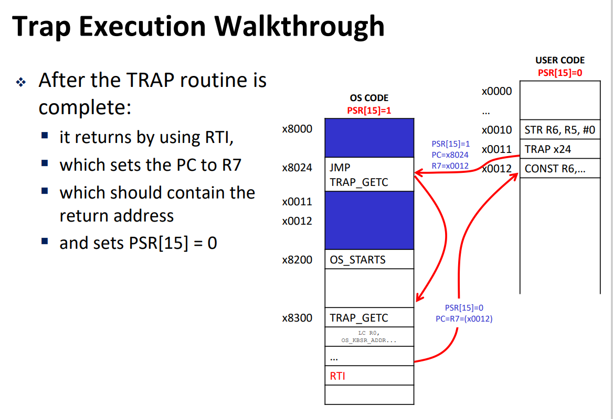

# Lecture Notes Outline for CIS2400: Introduction to Computer Systems

- [Lecture Notes Outline for CIS2400: Introduction to Computer Systems](#lecture-notes-outline-for-cis2400-introduction-to-computer-systems)
  - [Introductions, Binary, 2's Compliment, Integer Operations, Floats](#introductions-binary-2s-compliment-integer-operations-floats)
  - [Rounding, Logical Op's, Boolean Algerbra](#rounding-logical-ops-boolean-algerbra)
  - [Reciataion 00: Binary Representations](#reciataion-00-binary-representations)
  - [Intro to CMOS \& Transistors \& PLAs \& Applications](#intro-to-cmos--transistors--plas--applications)
  - [Combinational Logic](#combinational-logic)
  - [Sequential Logic](#sequential-logic)
  - [Memory \& ISA](#memory--isa)
  - [LC4 Intro](#lc4-intro)
  - [LC4 Single Cycle Processor](#lc4-single-cycle-processor)
  - [Intro to OS](#intro-to-os)
  - [I/O and subroutines in LC4](#io-and-subroutines-in-lc4)
  - [TRAP Instruction](#trap-instruction)
  - [C Intro](#c-intro)
  - [C Tools \& Compilation](#c-tools--compilation)
  - [Makefiles \& File I/O](#makefiles--file-io)
  - [History, Processors, ISAs](#history-processors-isas)
  - [C to ASM](#c-to-asm)
  - [J compiler Overview](#j-compiler-overview)

## Introductions, Binary, 2's Compliment, Integer Operations, Floats

- Numerical Encoding
  - Binary
  - Hexadecimal
  - Conversions between Binary, Hex, and Decimal
    - Dec & Bin
      - Dec to Bin
        - Subtraction power of 2
        - Divison
      - Bin to Dec
        - sum the weight of bits, base 2
    - Hex & Bin
      - Hex to Bin: expand the hex digit
      - Bin to Hex: 4 digits as a group and translate to hex
    - Dec & Hex
      - Hex to Dec: sum the weight of bits, base 16
      - Dec to Hex: division by 16
      - or first translate to binary
- Character Encoding
  - ASCII
  - Unicode
- Length Constraints
  - Bit
  - Nibble
  - Bytes
- Data Representation
  - sign-magnitude
  - 1's compliment
  - 2's compliment
    - for positive number and 0, their 2's compliment is the number itself
    - for other numbers, flip the bits and add 1 to it and get their 2's compliment results
- Integer Operations
  - Binary Addition
    - Add from right to left
    - works for both unsigned and 2's compliment numbers
    - memory space for a typical type is limited -> Addition Overflow!
      - When an operation's result is too large to fit in the type's range
      - For Unsigned
        - Always problemetic!
      - For signed(2's compliment)
        - If **the sign bit of the 2 adders are the same** and **MSB(Sign bit) of the output is different from the two adders**, it's problemetic!
        - Otherwise it's not!
  - Binary Subtraction
    - **A - B = A + [-B]**
    - we negate B and then add it to A
  - Multiplication
  - Division
  - Modulo
- Floats
  - 2's compliment addition & subtraction rules are the same
  - Floats Composition
    - Sign: 0/1(1 bit)
    - Ones Place: the decimal before the binary point, must be 1(implicit, not stored on memory)
    - Mantissa: the digits after the binary point(23 bits, after the exponent part)
    - Exponent: the exp of base 2, shift by 127(8 bits, must subtract 127 from the `exponent` part)
  - Conversion from Decimal to Floats
    1. Mark the sign bit and then ignore it
    2. Convert from decimal to fixed point binary
    3. multiply by `1`($2^0$)
    4. shift the points by changing the exponent
       - shift to left: decrement exponent
       - shift to right: increment exponent
    5. Add bias to the exponent then store: + 127
    6. store mantissa(place the decimal points from left to right)
  - Special Numbers: 5 situations
  - Problems
    - Underflow: a result is too small in magitude to be representable
    - Solution
      - choose data type with more bits
      - use custom data types that are only bound by memory size
      - Rigorious testing of software

> What's the difference between Unicode & UTF-8?

## Rounding, Logical Op's, Boolean Algerbra

- Logical operations
  - Bitwise(`& | ^ ~`)
  - on data(`&& || ^ !`)
  - application: clearing bits & masking
- Shifting bits
  - logical
  - arithmetic
  - left shift
    - multiplication
    - padding 0 to the end
  - right shift
    - division
    - logical: add 0 to the left(`unsigned int`)
    - arithmetic: add sign bit to the left(`int/signed int`)
- Boolean Logic rules
  - Identity
  - Associative
  - Distributive
  - De Morgan's Law

## Reciataion 00: Binary Representations

- Overview
  - Meaning of bits
  - Hex
- Two's complement
  - Alternate Explanation
  - Shifting
- Floating Point
  - Alternative Explanation
  - Conversion
  - Limited Space & Underflow

## Intro to CMOS & Transistors & PLAs & Applications

- Physics Background
  - Charge, Current, Voltage
  - Transistor
    - an electrical device that acts as an electrical switch
    - 3 electrical contacts/terminals: Gate, Drain, Source
    - Gate controls flow of current between Drain and Source terminals; this style transistor is called a MOSFET
      - Gate on: the switch is on
      - Otherwise: the switch is off
- CMOS Transistors
  - nMOS(positive)
    - Gate high voltage(Gate voltage > source and drain voltage) -> on
  - pMOS(negative)
    - Gate low voltage(Gate voltage < source and drain voltage) -> on
- CMOS Logical Circuits
  - Voltages as bits
    - high voltage -> 1
    - low voltage -> 0
  - CMOS Circuits as logical circuits
    - Split the `NOT` circuit into 2 halves
    - pMOS connect output with the source(1), **when pMOS is on(low voltage on pMOS) -> output 1**
    - nMOS connect output with the ground(0), **when nMOS is on(high voltage on nMOS) -> output 0**
    - only 2 states, no 3
    - summary
      - pMOS used for PUN
      - nMOS used for PDN
      - nMOS & pMOS are just switch, to design a gate, you just need to write out the formula, and set those `&&` with series circuits(串联电路), set those `||` with parallel circuits(并联电路). And then substitute those switch for `nMOS` or `pMOS` according to the circuit feature.(remember to extract `~`)
- CMOS Circuit Design
  - Rules
    - you cannot have pMOS transistor in the PDN
    - you cannot have nMOS in the PUN
    - exactly on of PDN/PUN must be on at a time
    - **if PUN series, then PDN is parallel, and vice versa**
    - Every transistor in the PDN must have a complimentary transistor in the PUN
    - start with PDN and then do the PUN
    - simplify the logic
    - get PUN from the PDN
      - Series relations in PDN become Parallel relations in PUN
      - Parallel relations in PUN become Series relations in PUN
      - nMOS transistors become pMOS transistors
  - [example](https://www.seas.upenn.edu/~cis2400/22fa/slides/lecture03.pdf)
- Logic Gates & PLAs
  - Logic Gates
    - Abstract away the messy details of `CMOS` circuits!
    - Gates of more complex operations exists
    - Gates can be combined to make more complex functions
  - PLA
    - A device where we can configure AND, OR and NOT gates to implement a function
- Transistors in the Real world
  - Moore's Law: number of transistors that can be put in an integrated circuit doubles every 18 months
  - Gates delay

## Combinational Logic

- Incrementor
- Adder & Subtracter
- Mux
- Multiplier & Others

## Sequential Logic

- Sequential Setup
  - circuits used to store some states
- R-S Latch, D latch, Clock
  - Latch
    - can store a data coming in
    - R-S Latch
      - push the latch from one state to another by **setting** or **resetting** it with R-S signals
      - created by cross coupled NAND Gates
      - 2 input
        - S and R
      - 2 output
        - Q and not Q
      - $RS != 0$
- D latch
  - S = D & R = not(D)
  - could add a **clock** to control if the bits should be input into the latch
  - use a `AND` gate to control the clock and D input
  - when clock is high, push the value of D into the latch, otherswise stays the same
  - can add a `WE` as an enable signal
- D flip flops
  - Composition
    - Appending a transparent-high onto a transparent-low latch
    - $Q_{inter}$ is the result of passing D through a transparent-low latch
    - $Q$ is the result of passing $Q_{inter}$ through a transparent-high latch
    - this makes Q only sensitive to the signal value **at the rising edge of the clock**
    - `not(clock)` into the first D latch(transparent-low), `clock` into the second D latch(transparent-high)
    - can add a `WE ` to the first latch as an enable signal

## Memory & ISA

- D flip flops & Registers
  - flip flop: 1 bit storage container
  - Register
    - group multiple D flip flop together to form a register
    - controlled by a common CLK clock signal
- Memory at a high level
  - memory is a huge array!
  - Basic memory usage
    - selecting a location to `read` from
    - selecting a location to `write` to
- Memory using flip flops
  - A simple implementation
    - a Decoder to decode register selection signal `A`
    - use a AND gate to connect decoder output and `WE`
    - WE should be input into each register
    - $D_{in}$ is connected to each register
    - each $D_{out}$ is connected to a MUX
    - the MUX select the output of the register according to the selection signal `A`
  - Advanced a little: independent Read/Write
    - read and write selection signal could be separated as `Ar` and `Aw`
  - Advanced more: multiple reads
    - use 2 MUX and 2 read selection signal
    - read 2 output at once
  - More memory details
    - logical structure of memory
      - address decoder
      - word select line, word write enable
      - bit lien
    - 2 types of RAM(Random access memory)
      - Static RAM(SRAM)
      - Dynamic RAM(DRAM)
- Memory hierarchy
  - the distance data must travel on hardware affects how long it taks for that data to be processed
  - data closer to the CPU is faster to access
  - cache
  - Principle of Locality
    - The tendency for the CPU to access the same set of memory locations over a short period of time
    - 2 main types
      - Temporal Locality: if we access a portion of memory, we will likely to reference it again soon
      - Spatial Locality: if we access a portion of memory, we will likely reference memory close to it in the near future.
  - Hierarchy: Regs -> L1 Cache(SRAM) -> L2 Cache(SRAM) -> L3 Cache(SRAM) -> Main Memory(DRAM) -> Local secondary storage(local disks) -> Remote secondary storage(Web servers)
  - Smaller, faster, and more costly(per byte), and vice versa
- ISA
  - Introduction
    - instruction set architecture
    - defines everything needed to create a program that runs directly on a processor
    - Serves as the contract between software and hardware
  - Basic components of ISA
    - Memory: address space and addressing method
    - Instructions: What operations are available, how instructions are encoded
    - Registers: How many registers, what size they are, and how they are used

## LC4 Intro

- Registers
  - 16 bit each
  - 8 of those(R0 - R7)
- Instructions
  - Examples
    - ADD Rd, Rs, Rt
      - Rd: destination
      - Rs: first source reg
      - Rt: second source reg
    - CONST Rd, IMM9
      - Action: Rd = SEXT(IMM9)
      - IMM9: 9 bits immediate
      - SEXT: sign extend the IMM9 to 16 bits
      - Rd: store in reg Rd
    - MUL Rd, Rs, Rt
    - ADD Rd, Rs, IMM5
      - Action: Rd = Rs + SEXT(IMM5)
  - Operations
    - Arithmetic operations
      - ADD
      - MUL
      - SUB
      - DIV
      - ADD(IMM)
      - MOD
    - Bitwise Instructions
      - AND
      - NOT
      - OR
      - XOR
      - AND
    - Shift Instructions
      - SLL: Shift left
      - SRA: Shift Right Arithmetic
      - SRL: Shift Right Logical
  - Encodings
    - each inst 16 bits
    - the 16 bits could be used to
      - identify the inst
      - identify the regs
      - identify other integer constants
    - First 4 bits -> op code, used to identify the operation
  - CONST & HICONST
    - if we want to set a register value that can't be expressed in 9-bit value, we need to use CONST and then HICONST
    - HICONST Rd, UIMM8
  - Program Counter, JMP, BR, JSR
    - Program Counter - keeps track of the address of the next instruction to execute
    - JMP IMM11
      - PC = PC + SEXT(IMM11) + 1
    - JMPR Rs
      - PC = Rs
    - NZP: the result value if **Negative(-1)/Zero(0)/Positive(1)**
    - Jump based on the NZP using BR instructions
    - [Branch Instructions](https://www.seas.upenn.edu/~cis2400/22fa/slides/lecture08.pdf)
    - [Comparison Instructions](https://www.seas.upenn.edu/~cis2400/22fa/slides/lecture08.pdf)
    - JSR & JSRR
    - TRAP & RTI
    - Immediates
    - Comments
    - LC4 Labels
    - LC4 ASM Directives
      - `.CODE`
      - `.DATA`
      - `.ADDR`
    - LC4 ASM Files
    - Text Files
    - PennSim Commands
    - Program Control sturctures: if & loops
  - Memory
    - LDR and STR
  - More Details
    - [Reference 1](https://www.seas.upenn.edu/~cis2400/22fa/slides/lecture08.pdf)
    - [Reference 2](https://www.seas.upenn.edu/~cis2400/22fa/slides/lecture09.pdf)
    - [Reference 3](https://www.seas.upenn.edu/~cis2400/22fa/slides/rec04.pdf)
    - [Cheatsheet](https://www.seas.upenn.edu/~cis2400/22fa/documents/LC4Instructions.pdf)

## LC4 Single Cycle Processor

- Von Neuman & Processor Start
  - Von Neuman Loop
    - Fetch Instructions at Program Counter
    - Decode Instruction
    - Execute Instruction & Update PC
    - Repeat
- LC4 Single Cycle & Processor
  - Decoder
  - Register File
  - ALU
  - Branch Unit
  - The Rest
  - Single Cycle

## Intro to OS

- 3 advantages
  - isolation: isolate each process memory space from each other
  - abstract: abstract away the details of various devices and provide a standarlized and portable interface
  - manages hardware resources

## I/O and subroutines in LC4

- I/O Devices & I/O Controller
  - Intro
    - I/O Devices have their own hardware
    - all have digital interfaces presented by **I/O Controller**
    - I/O Devies(analog/digital mix) <-> I/O Controller <-> CPU(digital)
    - Controller acts as a translator
  - I/O Controller to CPU Interface
    - abstract Devices as `device registers`
    - a register consists of 2 parts
      - Control/Status bit
        - status: if data is ready to be written/read
      - Data: may be more than 1 register
    - Reading/Writing Procedure
      1. check for status
      2. get data
  - LC4 I/O Devices
    - Memory Mapped I/O
      - Assign a memory address to each device register
      - use conventional loads and stores
      - hardware intercepts loads/stores to these address
      - no actual memory access performed
    - Keyboard
    - ASCII Console
    - 128x124 RGB Pixel display
    - Timer
- Interacting with I/O in LC4 Asm
  - Memory Mapped I/O (use LDR/STR for LC4)
  - Keyboard && ASCII Display
  - Timer
  - Video Display
- Subroutines in LC4
  - functions -> subroutines
  - JSR
  - JSRR
  - RET

## TRAP Instruction

- Introduction
  - OS code segment(signed with `.CODE`) and user program is separated
  - When a **user program** wants a piece of data from OS(the console memory I/O, for example), it cannot reach ths OS memory **(privilage bit = 0)**
  - When **OS** perform the operation, it's **privilage bit = 1**, it cannot call a subroutine from user space
  - What can we do? **Use a TRAP instruction to change the privilage bit from 0 to 1 in CPU!**
- What is trap?
  - subroutines in OS code
  - Allow a program running in USER Program Memory, to call a subroutine installed in OS Program Memory by calling `TRAP <trap_number>`
- TRAP vs JSR
  - 3 steps
    1. pc = pc + 1
    2. pc = the new directive address
       **3. PRIVILAGE BIT = 1 (ONLY TRAP INSTRUCTION HAS THIS STEP)**
- Limitation
  - only the first 256 memory locations of the OS program
  - To control what portion of OS memory the USER can jump to
  - In this example: PC = (x8000 | UIMM8)
  - thus we cannot have os memory starting from 0x8000
  - make the first 256 lines of os program memory a trap table(`JMP <label>`), when a user program calls a trap, it jumps to the according starting position of the trap routine
  - os program memory is after the trap table
- Trap process
  
  - When a TRAP is called:
    1. CPU sets PSR[15]=1,
    2. stores PC+1 in R7 and Jumps to entry in the TRAP Table
    3. This address is a JMP instruction which redirects to the TRAP routine
  - After the TRAP routine is complete:
    1. it returns by using RTI, which sets the PC to R7
    2. which should contain the return address and sets PSR[15] = 0
- Trap vs Subroutines
  - Common
    - Pass data the same way
    - may overwrite values
    - traps can access user data
    - R7 contains the return address
  - Differences
    - Differenct instructions
    - cannot call multiple traps
    - trap exists in os and needs os privilage

## C Intro

- Pointers, Arrays, Strings
- Memory Allocation & Structs
  - Memory map & stack & heap
  - Static & Automatic & Dynamic

## C Tools & Compilation

- Memory Errors, Valgrind & gdb
  - Buffer Overflow(forgot string's `\0` terminated)
  - Not checking for NULL
  - `free()` a pointer in the middle of a block
  - double free
  - malloc not initialize memory
- C header files & Modules
- C compilation, definitions & declarations, Cpp
  - Cpp preprocess the source file
    - saves the `define` value in the preprocessor states
    - append the `typedef` and other header file lines into the result source files
- Makefiles

## Makefiles & File I/O

- Makefiles
- Command Line Args
- File I/O
- Binary files & Endianness

## History, Processors, ISAs

- Some History on Computer Systems
- Modern Processors & ISAs

## C to ASM

- Global in ASM
- Stack
  - maintaining the stack in asm
    - A Frame holds a few things
      - Local variables, return value, arguments
      - Return address (where to return to after this function)
      - A copy of the previous frame pointer (so we can restore it after 
      this function finishes)
      - Temporary Data
      - Arguments to other functions we call from this function (callees)
  - prologue
  - epilogue
  - register spilling
  - implications of the stack system
- Compilation Process
- Control Structures

## J compiler Overview
.j -> .asm
