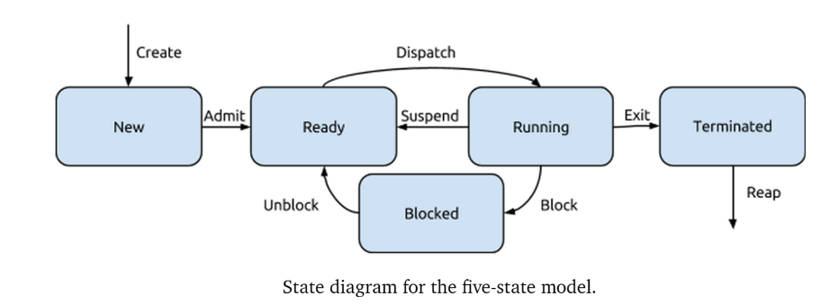
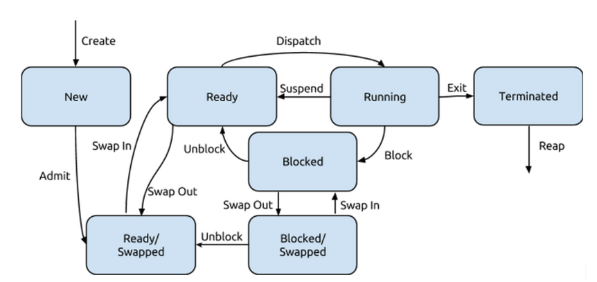

# Notes for ECE252 - System Programming

## File System

### File Attributes

- Name
- Identifiers
- Type
- Location
- Size
- Protection
- Time, Data, UserID

### File Operations

- Create
- Write
- Read
- Response to
- Delete
- Truncate

`fopen`几种 modes:

- `r` read
- `w` Truncate(create if not exists)
- `a` append(create if not exists)
- `r+` read/write
- `w+` read/write(create if not exists/otherwise truncated)
- `a+` read/write(create if not exists/output appended to the end of the file)
- `rb` read as binary

### Reading & Writing

- `fread`
- `fwrite`
- `fprintf`
- `fscanf`
- `fgets`
- ...

### File Types

- `.docx`
- `.txt`
- ...

### Directories

- Search
- Add
- Remove
- List
- Rename
- Navigate

### File Permissons

- Read
- Write
- Execute
- Append
- Delete
- List

## Process

### Process Components

- Instructions & Data of the program
- Current State of the program
- Any resources that are needed to execute the program

### Process Control Block

- Identifiers
- State
- Priority
- Program Counter(restored when needed)
- Register Data(Context Data)(restored when needed)
- Memory Pointers
- I/O Status Information
- Accounting Information

### The Circle of Life

#### Process Creation

- 3 situations
  - System Boot up
  - User requests a new process
  - one process sprawns another

#### Process Destruction

- 4 situations
  - Normal Exit
  - Error Exit
  - Fatal Error
  - Killed by Others

### Process Family Tree

- Zombie
- Orphan

### The Five-State Model

- Running
- Ready
- Blocked
- New
- Terminated
  

### Swapping Processes to Disk

## IPC

1. File System
2. Message Passing
3. Shared Memory
