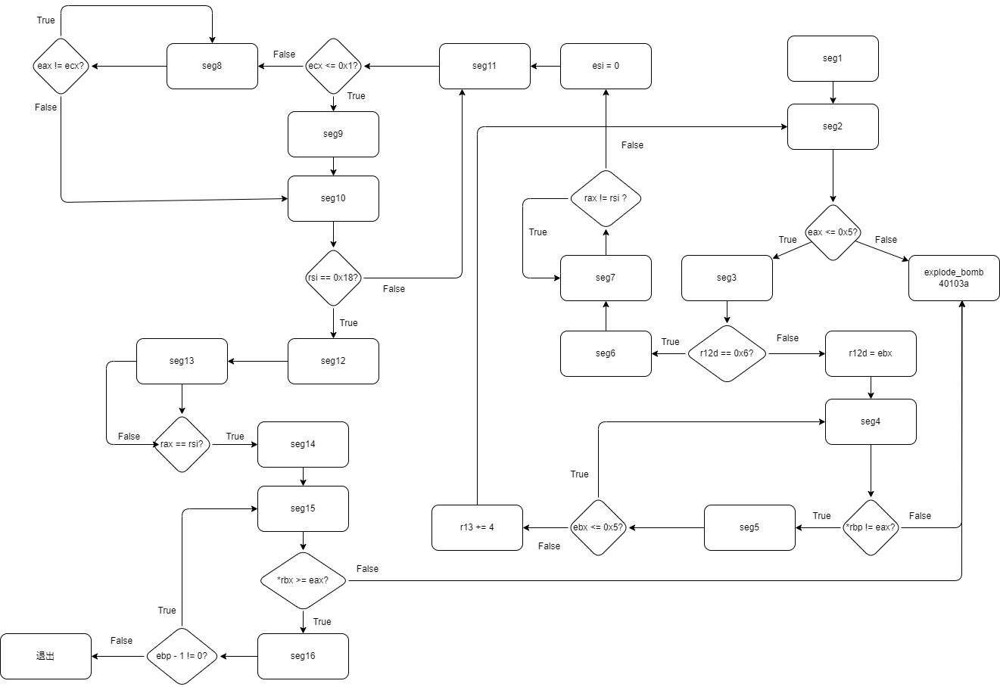
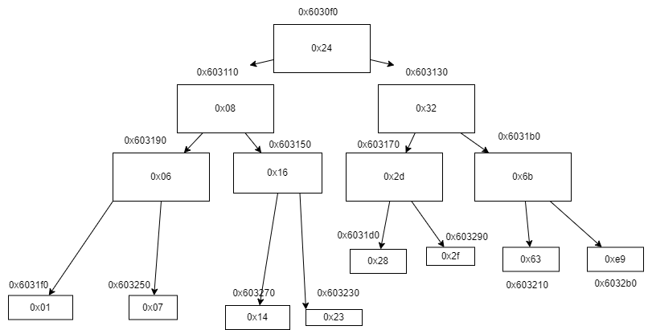

# CSAPP lab 2 - Bomb lab 实验记录

- [CSAPP lab 2 - Bomb lab 实验记录](#csapp-lab-2---bomb-lab-实验记录)
  - [前言](#前言)
  - [题目浏览](#题目浏览)
  - [phase1 分析: 基础读值](#phase1-分析-基础读值)
  - [phase2 分析: 分支跳转 \& 循环](#phase2-分析-分支跳转--循环)
  - [phase3 分析：`switch`语句](#phase3-分析switch语句)
  - [phase4 分析：递归](#phase4-分析递归)
  - [phase5 分析: `canary`，循环与 ASCII 编码字符串](#phase5-分析-canary循环与-ascii-编码字符串)
  - [phase6 分析: 超级无敌杂糅嵌套多层循环](#phase6-分析-超级无敌杂糅嵌套多层循环)
    - [Proc 1](#proc-1)
    - [Proc 2](#proc-2)
    - [Proc 3](#proc-3)
    - [Proc 4](#proc-4)
    - [Proc 5](#proc-5)
    - [Proc 6](#proc-6)
  - [secret phase 分析:](#secret-phase-分析)
  - [总结](#总结)
  - [参考资料](#参考资料)

## 前言

我看见网上非常多的教程里面是一边使用`gdb`调试（过程中可能引爆炸弹），一边探索结果的。他们可能多次启动了`GDB`来完成实验。但是我在`bomb.c`中看到了如下指示:

```
No VICTIM may debug, reverse-engineer, run "strings" on, decompile, decrypt, or use any other technique to gain knowledge of and defuse the BOMB.
```

并且在 CSAPP 3e 的 handout 中也写的很清楚，不应该多次启动 gdb 来通过输入随机序列的方式来探测密码，毕竟解引的机会只有一次。如果引爆炸弹，autolab 的分数会掉。所以正确的方法应该是对汇编程序进行逆向分析，然后推算炸弹的密码，而不是通过多次输入字符串来利用炸弹进行测试。

不要一开始就开`gdb`运行`phase`，可以先启动`gdb`，在`main`函数部分打断点，因为很多地方需要从`gdb`中获取信息，但是我们又不能直接开始做题，因为一做题就无法二次启动`gdb`了（会扣实验分）。最好是把每个`phase`都分析透彻，得出确定的答案了，再在`gdb`中运行，因为中间没有空闲给你打断点和运行，直接进入`gets`输入了。

6 道题的答案为（如果用文件输入的话，记得最后有个换行符，否则炸弹爆炸）：

```
Border relations with Canada have never been better.
1 2 4 8 16 32
0 207
0 0 DrEvil
IONEFG
4 3 2 1 6 5
20

```

## 题目浏览

首先我们使用`wget`命令从[实验官网](https://csapp.cs.cmu.edu/3e/labs.html)下载`tar`文件，使用`tar xvf bomb.tar`解压文件。

打开文件夹，里面有 2 个重要文件，分别是`bomb.c`和`bomb`二进制文件。我们使用`objdump -d bomb > bomb.s`生成二进制可执行文件的反汇编并存储在`bomb.s`中。`bomb.c`中只有`main`函数的部分，`main`函数调用的那些函数只在二进制文件和汇编代码中存在。

我们首先来看`bomb.c`，其中含有 6 个 phase 的炸弹，我们需要依次解开。在函数最开始处作者声明可以有多种输入格式，可以从`stdin`获取输入，也可以从文件获取输入。每个 phase 都有如下两行：

```c
phase_n(input);      /* Run the phase               */
phase_defused();     /* Drat!  They figured it out!
```

## phase1 分析: 基础读值

`phase_1`的汇编代码如下：

```
0000000000400ee0 <phase_1>:
  400ee0:	48 83 ec 08          	sub    $0x8,%rsp
  400ee4:	be 00 24 40 00       	mov    $0x402400,%esi
  400ee9:	e8 4a 04 00 00       	callq  401338 <strings_not_equal>
  400eee:	85 c0                	test   %eax,%eax
  400ef0:	74 05                	je     400ef7 <phase_1+0x17>
  400ef2:	e8 43 05 00 00       	callq  40143a <explode_bomb>
  400ef7:	48 83 c4 08          	add    $0x8,%rsp
  400efb:	c3                   	retq
```

其过程如下：

1. 留出 8 个字节的空间
2. 让`%esi = 0x402400`，
3. 调用`strings_not_equal`函数
4. 测试`%eax`是否等于 0
5. 若返回值为 0，则恢复栈帧，退出
6. 否则引爆炸弹

这里推测`%esi`是给`strings_not_equal`提供的参数，且`string_not_equal`返回的是个`int`类型整数。

我们打开`gdb`，打好断点并运行，输入`call strings_not_equal("a","a")`发现返回 0。输入`call string_length("a")`发现返回 1。那么`strings_not_equal`的作用就是判断两字符串是否不相等，`string_length`的作用就是计算字符串的长度。

我们的目的是让`strings_not_equal`返回 0，也就是说我们需要传入两个相同的字符串。那么问题在于我们传入的字符串存储在哪里呢？我们看一下`strings_not_equal`的反汇编代码：

```asm
0000000000401338 <strings_not_equal>:
seg1:
  401338:	41 54                	push   %r12
  40133a:	55                   	push   %rbp
  40133b:	53                   	push   %rbx
  40133c:	48 89 fb             	mov    %rdi,%rbx
  40133f:	48 89 f5             	mov    %rsi,%rbp
  401342:	e8 d4 ff ff ff       	callq  40131b <string_length>
  401347:	41 89 c4             	mov    %eax,%r12d
  40134a:	48 89 ef             	mov    %rbp,%rdi
  40134d:	e8 c9 ff ff ff       	callq  40131b <string_length>
  401352:	ba 01 00 00 00       	mov    $0x1,%edx

  401357:	41 39 c4             	cmp    %eax,%r12d
  40135a:	75 3f                	jne    40139b <strings_not_equal+0x63>
  40135c:	0f b6 03             	movzbl (%rbx),%eax

  40135f:	84 c0                	test   %al,%al
  401361:	74 25                	je     401388 <strings_not_equal+0x50>

  401363:	3a 45 00             	cmp    0x0(%rbp),%al
  401366:	74 0a                	je     401372 <strings_not_equal+0x3a>
  401368:	eb 25                	jmp    40138f <strings_not_equal+0x57>
seg2:
  40136a:	3a 45 00             	cmp    0x0(%rbp),%al
  40136d:	0f 1f 00             	nopl   (%rax)
  401370:	75 24                	jne    401396 <strings_not_equal+0x5e>
seg3:
  401372:	48 83 c3 01          	add    $0x1,%rbx
  401376:	48 83 c5 01          	add    $0x1,%rbp
  40137a:	0f b6 03             	movzbl (%rbx),%eax

  40137d:	84 c0                	test   %al,%al
  40137f:	75 e9                	jne    40136a <strings_not_equal+0x32>
  401381:	ba 00 00 00 00       	mov    $0x0,%edx
  401386:	eb 13                	jmp    40139b <strings_not_equal+0x63>
seg4:
  401388:	ba 00 00 00 00       	mov    $0x0,%edx
  40138d:	eb 0c                	jmp    40139b <strings_not_equal+0x63>
seg5:
  40138f:	ba 01 00 00 00       	mov    $0x1,%edx
  401394:	eb 05                	jmp    40139b <strings_not_equal+0x63>
seg6:
  401396:	ba 01 00 00 00       	mov    $0x1,%edx
seg7:
  40139b:	89 d0                	mov    %edx,%eax
  40139d:	5b                   	pop    %rbx
  40139e:	5d                   	pop    %rbp
  40139f:	41 5c                	pop    %r12
  4013a1:	c3                   	retq
```

其 C 语言代码分析如下：

```c
seg2()
{
    if(al != *rbp) {
        seg6();
    }
    else{
        seg3();
    }
}

seg3()
{
    rbx += 1;
    rbp += 1;
    eax = *rbx;
    if(al != 0) {
        // seg2
        seg2();
    }
    else {
        edx = 0;
        seg7();
    }
}

seg4()
{
    edx = 0;
    seg7();
}

seg5()
{
    edx = 1;
    seg7();
}

seg6() {
    edx = 1;
    seg7();
}

seg7()
{
    eax = edx;
    //还原rbx rbp r12
    return eax;
}

// 传入参数有 rdi rsi，返回值在eax中
int strings_not_equal(char* str)
{
    // seg1
    // 保存r12 rbp rbx的值
    rbx = rdi
    rbp = rsi
    call string_length
    r12d = eax
    rdi = rbp
    call string_length
    edx = 0x1;

    if(r12d != eax) {
        seg7();
    }
    else {
        eax = *rbx;
        if(al == 0) {
            seg4();
        }
        else {
            if(al == *rbp) {
                seg3();
            }
            else {
                seg5();
            }
        }
    }
}
```

我们对调用的函数`string_length`反汇编看一下：

```
000000000040131b <string_length>:
  40131b:	80 3f 00             	cmpb   $0x0,(%rdi)
  40131e:	74 12                	je     401332 <string_length+0x17>
  401320:	48 89 fa             	mov    %rdi,%rdx
  401323:	48 83 c2 01          	add    $0x1,%rdx
  401327:	89 d0                	mov    %edx,%eax
  401329:	29 f8                	sub    %edi,%eax
  40132b:	80 3a 00             	cmpb   $0x0,(%rdx)
  40132e:	75 f3                	jne    401323 <string_length+0x8>
  401330:	f3 c3                	repz retq
  401332:	b8 00 00 00 00       	mov    $0x0,%eax
  401337:	c3                   	retq
```

其 C 语言转化如下：

```c
// 传入参数为 rdi，推测其为字符串的首地址
int string_length()
{
    if(*rdi == 0x0) {
        rax = 0;
        return rax;
    }
    rdx = rdi;
    do{
        rdx += 0x1;
        eax = edx;
        eax -= edi;
    }while(*rdx != 0x0);
    return rax;
}
```

因为`string_length`中传入的应该是字符串首地址，存储在寄存器`%rdi`中。而`strings_not_equal`中我们使用了两个寄存器`%rdi`和`%rsi`，那么`%rsi`中保存的应该是第二个字符串的地址。而在`phase_1`中，我们让`%rsi = 0x402400`，也就是说`0x402400`这里有个字符串，我们要让输入的字符串和这里的字符串相同，才能让`%rax = 0`。

输入`x/s 0x402400`，得到如下结果：

```
(gdb) x/s 0x402400
0x402400:       "Border relations with Canada have never been better."
```

这就是我们应该在`phase_1`中输入的字符串了！让我们来试试！结果如下：

```
(gdb)
Phase 1 defused. How about the next one?
81          printf("Phase 1 defused. How about the next one?\n");
```

成功！现在准备解决`phase_2`的问题，`gdb`先不管。

## phase2 分析: 分支跳转 & 循环

`phase_2`的反汇编如下：

```
0000000000400efc <phase_2>:
  400efc:	55                   	push   %rbp
  400efd:	53                   	push   %rbx
  400efe:	48 83 ec 28          	sub    $0x28,%rsp
  400f02:	48 89 e6             	mov    %rsp,%rsi
  400f05:	e8 52 05 00 00       	callq  40145c <read_six_numbers>
  400f0a:	83 3c 24 01          	cmpl   $0x1,(%rsp)
  400f0e:	74 20                	je     400f30 <phase_2+0x34>
  400f10:	e8 25 05 00 00       	callq  40143a <explode_bomb>

  400f15:	eb 19                	jmp    400f30 <phase_2+0x34>

  400f17:	8b 43 fc             	mov    -0x4(%rbx),%eax
  400f1a:	01 c0                	add    %eax,%eax
  400f1c:	39 03                	cmp    %eax,(%rbx)
  400f1e:	74 05                	je     400f25 <phase_2+0x29>
  400f20:	e8 15 05 00 00       	callq  40143a <explode_bomb>

  400f25:	48 83 c3 04          	add    $0x4,%rbx
  400f29:	48 39 eb             	cmp    %rbp,%rbx
  400f2c:	75 e9                	jne    400f17 <phase_2+0x1b>
  400f2e:	eb 0c                	jmp    400f3c <phase_2+0x40>

  400f30:	48 8d 5c 24 04       	lea    0x4(%rsp),%rbx
  400f35:	48 8d 6c 24 18       	lea    0x18(%rsp),%rbp
  400f3a:	eb db                	jmp    400f17 <phase_2+0x1b>

  400f3c:	48 83 c4 28          	add    $0x28,%rsp
  400f40:	5b                   	pop    %rbx
  400f41:	5d                   	pop    %rbp
  400f42:	c3                   	retq
```

我们将其转化为 C 语言试试：

```c
     // // 400f17
     // eax = *(rbx - 0x4);
     // eax *= 2;
     // if(*rbx == eax) {
     //     rbx += 4;
     //     if(rbx != rbp)
     //         //400f17
     //     else
     //         //400f3c
     //         //恢复栈空间和rbp rbx
     //         return eax;
     // }else {
     //     call explode_bomb
     // }
int phase_2()
{
    //保存rbp rbx
    //rsp留出40个字节
    rsi = rsp;
    call read_six_numbers
    if(*rsp == 0x1) {
        // 400f30
        rbx = rsp + 0x4;
        rbp = rsp + 24;

        // 400f17改写为循环
        do {
            eax = *(rbx - 0x4);
            eax *= 2;
            if(*rbx != eax)
                call explode_bomb
            rbx += 4;
        }while(rbx != rbp)
        return eax;
    }
    else {
        call explode_bomb
    }
}
```

我们对`read_six_numebrs`反汇编一下看看：

```
000000000040145c <read_six_numbers>:
  40145c:	48 83 ec 18          	sub    $0x18,%rsp
  401460:	48 89 f2             	mov    %rsi,%rdx
  401463:	48 8d 4e 04          	lea    0x4(%rsi),%rcx
  401467:	48 8d 46 14          	lea    0x14(%rsi),%rax
  40146b:	48 89 44 24 08       	mov    %rax,0x8(%rsp)
  401470:	48 8d 46 10          	lea    0x10(%rsi),%rax
  401474:	48 89 04 24          	mov    %rax,(%rsp)
  401478:	4c 8d 4e 0c          	lea    0xc(%rsi),%r9
  40147c:	4c 8d 46 08          	lea    0x8(%rsi),%r8
  401480:	be c3 25 40 00       	mov    $0x4025c3,%esi
  401485:	b8 00 00 00 00       	mov    $0x0,%eax
  40148a:	e8 61 f7 ff ff       	callq  400bf0 <__isoc99_sscanf@plt>
  40148f:	83 f8 05             	cmp    $0x5,%eax
  401492:	7f 05                	jg     401499 <read_six_numbers+0x3d>
  401494:	e8 a1 ff ff ff       	callq  40143a <explode_bomb>
  401499:	48 83 c4 18          	add    $0x18,%rsp
  40149d:	c3                   	retq
```

这里也有`explode_bomb`，有玄机啊~

先分析`read_six_numbers`，这里就一个跳转，整个过程容易分析：

```
1. 保留 24 个字节的位置
2. rdx = rsi
3. rcx = rsi + 0x4
4. rax = rsi + 20
5. *(rsp + 8) = rax
6. rax = rsi + 16
7. *rsp = rax
8. r9 = rsi + 12
9. r8 = rsi + 8
10. esi = 0x4025c3
11. eax = 0
12. call sccanf 获取输入
13. if(eax > 5) 恢复栈，返回 eax
14. 否则爆炸
```

这里传入的应该只有一个参数，就是`%rsi`寄存器中的值，在前面`phase_2`里面`%rsi = %rsp`。那么输入的值应该是从`%rsp`开始存储。我们使用如下命令打印`0x4025c3`处的值，得到如下结果：

```
(gdb) x/s 0x4025c3
0x4025c3:       "%d %d %d %d %d %d"
```

这里`%eax`中存储的应该是`sscanf`读入的数据个数，如果`%eax > 5`的话，`read_six_numbers`顺利过关，否则爆炸。

那么数组应该是保存在`%rsi`指向的位置（也就是一开始`%rsp`指向的位置），通过分析`phase_2`的代码，我们可以总结出以下要求：

1. 输入的第 1 个数必须是 1
2. 下一个数是前一个数的两倍
3. 输入 6 个数字，而且是整数，不是浮点数

那么了解了要求后，我们需要输入`1 2 4 8 16 32`这 6 个数，看看结果：

```
(gdb)
That's number 2.  Keep going!
88          printf("That's number 2.  Keep going!\n");
```

`phase_2`破解成功！我们继续`phase_3`！

## phase3 分析：`switch`语句

`phase_3`的反汇编代码如下：

```
0000000000400f43 <phase_3>:
  400f43:	48 83 ec 18          	sub    $0x18,%rsp
  400f47:	48 8d 4c 24 0c       	lea    0xc(%rsp),%rcx
  400f4c:	48 8d 54 24 08       	lea    0x8(%rsp),%rdx
  400f51:	be cf 25 40 00       	mov    $0x4025cf,%esi
  400f56:	b8 00 00 00 00       	mov    $0x0,%eax
  400f5b:	e8 90 fc ff ff       	callq  400bf0 <__isoc99_sscanf@plt>
  400f60:	83 f8 01             	cmp    $0x1,%eax
  400f63:	7f 05                	jg     400f6a <phase_3+0x27>
  400f65:	e8 d0 04 00 00       	callq  40143a <explode_bomb>

  400f6a:	83 7c 24 08 07       	cmpl   $0x7,0x8(%rsp)
  400f6f:	77 3c                	ja     400fad <phase_3+0x6a>
  400f71:	8b 44 24 08          	mov    0x8(%rsp),%eax
  400f75:	ff 24 c5 70 24 40 00 	jmpq   *0x402470(,%rax,8)
  400f7c:	b8 cf 00 00 00       	mov    $0xcf,%eax
  400f81:	eb 3b                	jmp    400fbe <phase_3+0x7b>
  400f83:	b8 c3 02 00 00       	mov    $0x2c3,%eax
  400f88:	eb 34                	jmp    400fbe <phase_3+0x7b>
  400f8a:	b8 00 01 00 00       	mov    $0x100,%eax
  400f8f:	eb 2d                	jmp    400fbe <phase_3+0x7b>
  400f91:	b8 85 01 00 00       	mov    $0x185,%eax
  400f96:	eb 26                	jmp    400fbe <phase_3+0x7b>
  400f98:	b8 ce 00 00 00       	mov    $0xce,%eax
  400f9d:	eb 1f                	jmp    400fbe <phase_3+0x7b>
  400f9f:	b8 aa 02 00 00       	mov    $0x2aa,%eax
  400fa4:	eb 18                	jmp    400fbe <phase_3+0x7b>
  400fa6:	b8 47 01 00 00       	mov    $0x147,%eax
  400fab:	eb 11                	jmp    400fbe <phase_3+0x7b>

  400fad:	e8 88 04 00 00       	callq  40143a <explode_bomb>
  400fb2:	b8 00 00 00 00       	mov    $0x0,%eax
  400fb7:	eb 05                	jmp    400fbe <phase_3+0x7b>
  400fb9:	b8 37 01 00 00       	mov    $0x137,%eax

  400fbe:	3b 44 24 0c          	cmp    0xc(%rsp),%eax
  400fc2:	74 05                	je     400fc9 <phase_3+0x86>
  400fc4:	e8 71 04 00 00       	callq  40143a <explode_bomb>

  400fc9:	48 83 c4 18          	add    $0x18,%rsp
  400fcd:	c3                   	retq
```

~~这段代码较长，我们将其转化为 C 语言试试~~：
我们先不转化成 C 语言，先来看一下让炸弹爆炸的几个条件。炸弹爆炸出现在如下几个地方：

```
  400f65:	e8 d0 04 00 00       	callq  40143a <explode_bomb>
  400fad:	e8 88 04 00 00       	callq  40143a <explode_bomb>
  400fc4:	e8 71 04 00 00       	callq  40143a <explode_bomb>
```

对第一处，我们先进行分析：

```
  400f43:	48 83 ec 18          	sub    $0x18,%rsp
  400f47:	48 8d 4c 24 0c       	lea    0xc(%rsp),%rcx
  400f4c:	48 8d 54 24 08       	lea    0x8(%rsp),%rdx
  400f51:	be cf 25 40 00       	mov    $0x4025cf,%esi
  400f56:	b8 00 00 00 00       	mov    $0x0,%eax
  400f5b:	e8 90 fc ff ff       	callq  400bf0 <__isoc99_sscanf@plt>
  400f60:	83 f8 01             	cmp    $0x1,%eax
  400f63:	7f 05                	jg     400f6a <phase_3+0x27>
  400f65:	e8 d0 04 00 00       	callq  40143a <explode_bomb>
```

这段代码首先分配了 24 个字节的栈空间，随后做了如下步骤：

1. rcx = rsp + 12
2. rdx = rsp + 8
3. esi = 0x4025cf
4. eax = 0
5. call sscanf
6. 将 eax 与 1 进行比较
7. 如果 eax > 1，跳转到`400f6a`
8. 否则炸弹爆炸

这段代码和我们上一段看到的`sscanf`之前的代码非常相似，`0x4025cf`多半是一个让你输入一串东西的指令地址，我们看一下`%esi(0x4025cf)`附近的值等于多少：

```
(gdb) x/s 0x4025cf
0x4025cf:       "%d %d"
```

这里说明我们需要输入 2 个数字，如果不是输入 2 个数字的话，炸弹就会爆炸。第一个要求明确了。

再来看第二处炸弹的位置前后的代码，它的上一条代码是个`jmp`，那么就不可能从那儿执行到这儿来，因为炸弹爆炸了，所以他后面的代码也不可能执行，所以我们只需要看看哪些代码会跳转到这一条(`400fad`)上来。

```
  400f6a:	83 7c 24 08 07       	cmpl   $0x7,0x8(%rsp)
  400f6f:	77 3c                	ja     400fad <phase_3+0x6a>
```

这段代码出现在我们获取了两个整数之后。这段代码比较了`*(rsp + 8)`和`0x7`的值。为了不跳转到`400fad`，我们需要让`%rsp + 8 <= 0x7`。第二个要求明确了。

最后一个炸弹前的代码如下：

```
  400fb9:	b8 37 01 00 00       	mov    $0x137,%eax

  400fbe:	3b 44 24 0c          	cmp    0xc(%rsp),%eax
  400fc2:	74 05                	je     400fc9 <phase_3+0x86>
  400fc4:	e8 71 04 00 00       	callq  40143a <explode_bomb>
```

这段代码中实现如下操作：

1. eax = 0x137
2. 如果`eax != *(rsp + 12)`，那么炸弹爆炸，也就是说输入的第二个参数最后必须等于`0x137`

现在问题来了，有几个代码通过跳转来到了`400fbe`位置，我们需要分析其情况，看看其是否对`%rsp + 12`处的值做了操作。

```
  400f7c:	b8 cf 00 00 00       	mov    $0xcf,%eax ->eax = 0xcf
  400f81:	eb 3b                	jmp    400fbe <phase_3+0x7b>
  400f83:	b8 c3 02 00 00       	mov    $0x2c3,%eax -> eax = 0x2c3
  400f88:	eb 34                	jmp    400fbe <phase_3+0x7b>
  400f8a:	b8 00 01 00 00       	mov    $0x100,%eax -> eax = 0x100
  400f8f:	eb 2d                	jmp    400fbe <phase_3+0x7b>
  400f91:	b8 85 01 00 00       	mov    $0x185,%eax -> eax = 0x185
  400f96:	eb 26                	jmp    400fbe <phase_3+0x7b>
  400f98:	b8 ce 00 00 00       	mov    $0xce,%eax -> eax = 0xce
  400f9d:	eb 1f                	jmp    400fbe <phase_3+0x7b>
  400f9f:	b8 aa 02 00 00       	mov    $0x2aa,%eax -> eax = 0x2aa
  400fa4:	eb 18                	jmp    400fbe <phase_3+0x7b>
  400fa6:	b8 47 01 00 00       	mov    $0x147,%eax -> eax = 0x147
  400fab:	eb 11                	jmp    400fbe <phase_3+0x7b>

  400fad:	e8 88 04 00 00       	callq  40143a <explode_bomb>
  400fb2:	b8 00 00 00 00       	mov    $0x0,%eax -> eax = 0
  400fb7:	eb 05                	jmp    400fbe <phase_3+0x7b>
  400fb9:	b8 37 01 00 00       	mov    $0x137,%eax -> eax = 0x137

  400fbe:	3b 44 24 0c          	cmp    0xc(%rsp),%eax
  400fc2:	74 05                	je     400fc9 <phase_3+0x86>
  400fc4:	e8 71 04 00 00       	callq  40143a <explode_bomb>
```

要注意的是指令`400f75:	ff 24 c5 70 24 40 00 	jmpq   *0x402470(,%rax,8)`中实现的是间接跳转（因为加了`*`），那么我们需要找到`0x402470`处的 8 字节地址，以它为跳转的基地址。

```
(gdb) x/wx 0x402470
0x402470:       0x00400f7c
```

这个地址就是`0x400f7c`。我们前面把输入的第一个数字移到了`%eax`，那么我们需要通过`0x400f7c + 8 * %eax`来确定我们的跳转目标。跳转以后会赋给`%eax`相应的值，而后我们需要保证我们输入的第二个数等于`%eax`。

这样逻辑就捋顺了，整个代码应该是一个`switch_case`的结构，而`0x400f7c`就是这个跳转表的首地址，`%eax`是对应的索引。这个`phase`的要求就是：

1. 输入 2 个整数
2. 第一个整数必须小于等于 0x7，因为最多只有 7 个`case`
3. 输入的第二个数必须和其`case`中赋给`%eax`的值相同

我们设计第一个数是`0`，那么第二个数就是`0xcf`(`207`)，我们试一试：

```
main (argc=<optimized out>, argv=<optimized out>) at bomb.c:90
90          /* I guess this is too easy so far.  Some more complex code will
(gdb) n
91           * confuse people. */
(gdb) n
Halfway there!
94          phase_defused();
```

成功！

## phase4 分析：递归

首先还是对`phase_4`进行了反汇编：

```
000000000040100c <phase_4>:
  40100c:	48 83 ec 18          	sub    $0x18,%rsp
  401010:	48 8d 4c 24 0c       	lea    0xc(%rsp),%rcx
  401015:	48 8d 54 24 08       	lea    0x8(%rsp),%rdx
  40101a:	be cf 25 40 00       	mov    $0x4025cf,%esi
  40101f:	b8 00 00 00 00       	mov    $0x0,%eax
  401024:	e8 c7 fb ff ff       	callq  400bf0 <__isoc99_sscanf@plt>
  401029:	83 f8 02             	cmp    $0x2,%eax
  40102c:	75 07                	jne    401035 <phase_4+0x29>

  40102e:	83 7c 24 08 0e       	cmpl   $0xe,0x8(%rsp)
  401033:	76 05                	jbe    40103a <phase_4+0x2e>
  401035:	e8 00 04 00 00       	callq  40143a <explode_bomb>

  40103a:	ba 0e 00 00 00       	mov    $0xe,%edx
  40103f:	be 00 00 00 00       	mov    $0x0,%esi
  401044:	8b 7c 24 08          	mov    0x8(%rsp),%edi
  401048:	e8 81 ff ff ff       	callq  400fce <func4>
  40104d:	85 c0                	test   %eax,%eax
  40104f:	75 07                	jne    401058 <phase_4+0x4c>
  401051:	83 7c 24 0c 00       	cmpl   $0x0,0xc(%rsp)
  401056:	74 05                	je     40105d <phase_4+0x51>

  401058:	e8 dd 03 00 00       	callq  40143a <explode_bomb>
  40105d:	48 83 c4 18          	add    $0x18,%rsp
  401061:	c3                   	retq
```

在本代码中进行了如下过程：

1. 预留出 24 个字节的空间
2. rcx = rsp + 12
3. rdx = rsp + 8
4. esi = 0x4025cf
5. eax = 0
6. sscanf 调用
7. 下面是带分支部分：

```c
if(eax != 0x2) {
    call bomb_explode
}
if(arg3 > 0xe) {
    call bomb_explode
}
edx = 0xe;
esi = 0x0;
edi = arg3
ret = func4(arg1,arg2,arg3)
if(eax != 0)
    call bomb_explode
if(arg2 == 0)
    return eax;
else
    call bomb_explode
```

这里出现了非常熟悉的`sscanf`调用，我们先看看`0x4025cf`处是啥（如果不出意外应该是`%d %d`）

```
(gdb) x/s 0x4025cf
0x4025cf:       "%d %d"
```

果然！果然！是让我们输入 2 个整数，如果不是两个的话就爆炸！此外，一开始的`arg3`应该小于等于`0xe`，否则爆炸，此外函数`func4`返回的`eax`应该为 0，否则爆炸。此外，`*(rsp + 12)`（如果`func4`里面没改变这个值的话应该还是`arg2`）必须等于 0。

那么我们来分析一下`func4`：

```
0000000000400fce <func4>:
  400fce:	48 83 ec 08          	sub    $0x8,%rsp
  400fd2:	89 d0                	mov    %edx,%eax
  400fd4:	29 f0                	sub    %esi,%eax
  400fd6:	89 c1                	mov    %eax,%ecx
  400fd8:	c1 e9 1f             	shr    $0x1f,%ecx
  400fdb:	01 c8                	add    %ecx,%eax
  400fdd:	d1 f8                	sar    %eax
  400fdf:	8d 0c 30             	lea    (%rax,%rsi,1),%ecx
  400fe2:	39 f9                	cmp    %edi,%ecx
  400fe4:	7e 0c                	jle    400ff2 <func4+0x24>

  400fe6:	8d 51 ff             	lea    -0x1(%rcx),%edx
  400fe9:	e8 e0 ff ff ff       	callq  400fce <func4>
  400fee:	01 c0                	add    %eax,%eax
  400ff0:	eb 15                	jmp    401007 <func4+0x39>

  400ff2:	b8 00 00 00 00       	mov    $0x0,%eax
  400ff7:	39 f9                	cmp    %edi,%ecx
  400ff9:	7d 0c                	jge    401007 <func4+0x39>

  400ffb:	8d 71 01             	lea    0x1(%rcx),%esi
  400ffe:	e8 cb ff ff ff       	callq  400fce <func4>
  401003:	8d 44 00 01          	lea    0x1(%rax,%rax,1),%eax

  401007:	48 83 c4 08          	add    $0x8,%rsp
  40100b:	c3                   	retq
```

看起来有点长，但是不要惊慌！这里只有 3 个跳转，而且其中两个都是跳转到最后恢复栈的位置。其主要步骤如下：

1. 分配 8 个字节的栈空间
2. eax = edx
3. eax -= esi
   -> eax = edx - esi
4. ecx = eax
5. ecx >> 31
   -> ecx = eax >> 31(eax 符号位拉满)
6. eax += ecx
7. eax >> 1
   -> eax = (eax + ecx) >> 1
8. ecx = rax + rsi
9. 下面进入一段分支：

```c
if(ecx <= edi) {
    //400ff2
    eax = 0;
    if(ecx >= edi) {
        // 401007
        return rax;
    }
    else{
        esi = rcx + 0x1;
        ret = func4(arg1,arg2,arg3)
        eax = rax + rax + 1;
        return rax;
    }
}
else {
    edx = rcx - 0x1;
    ret = func4(arg1,arg2,arg3)
    eax = eax * 2;
    return rax;
}
```

分析`func4`，我们不难发现，该函数的传入参数是`%edx`和`%esi`，此外该函数是个递归函数。函数总的过程应该如下：

```c
eax = edx - esi
ecx = eax >> 31 (逻辑右移)
eax = (eax + ecx) >> 1 (算数右移)
ecx = rax + rsi
if(ecx <= edi) {
   eax = 0;
   if(ecx >= edi) {
       // 401007
       return rax;
   }
   else{
       esi = rcx + 0x1;
       ret = func4(arg1,arg2,arg3)
       eax = rax * 2 + 1;
       return rax;
   }
}
else {
   edx = rcx - 0x1;
   ret = func4(arg1,arg2,arg3)
   eax = eax * 2;
   return rax;
}
```

经过变量调整重写的 C 版本如下：

```c
ret = arg3 - arg2
mid = ret >> 31
ret = (ret + ret >> 31) / 2;
mid = ret + arg2
if(mid <= arg1) {
   ret = 0;
   if(mid >= arg1) {
       return ret;
   }
   else{
    //    arg2 = mid + 1;
       return func4(arg1,mid + 1,arg3) * 2 + 1;
   }
}
else {
//    arg3 = mid - 1;
   return func4(arg1,arg2,mid - 1) * 2;
}
```

我们看看什么情况下`eax = 0`。（这到底是什么东西啊摔！）真没看懂是什么东西，试了个`0 0`，通过了，先 mark 一下，后面再来检验：

```
(gdb)
0 0
95          printf("Halfway there!\n");
```

## phase5 分析: `canary`，循环与 ASCII 编码字符串

```
(gdb)
97          /* Oh yeah?  Well, how good is your math?  Try on this saucy problem! */
```

数学不好呜呜呜。

phase_5 的反汇编代码如下：

```
0000000000401062 <phase_5>:
seg1:
  401062:	53                   	push   %rbx
  401063:	48 83 ec 20          	sub    $0x20,%rsp
  401067:	48 89 fb             	mov    %rdi,%rbx
  40106a:	64 48 8b 04 25 28 00 	mov    %fs:0x28,%rax
  401071:	00 00
  401073:	48 89 44 24 18       	mov    %rax,0x18(%rsp)
  401078:	31 c0                	xor    %eax,%eax
  40107a:	e8 9c 02 00 00       	callq  40131b <string_length>
  40107f:	83 f8 06             	cmp    $0x6,%eax
  401082:	74 4e                	je     4010d2 <phase_5+0x70>
  401084:	e8 b1 03 00 00       	callq  40143a <explode_bomb>

  401089:	eb 47                	jmp    4010d2 <phase_5+0x70>
seg2:
  40108b:	0f b6 0c 03          	movzbl (%rbx,%rax,1),%ecx
  40108f:	88 0c 24             	mov    %cl,(%rsp)
  401092:	48 8b 14 24          	mov    (%rsp),%rdx
  401096:	83 e2 0f             	and    $0xf,%edx
  401099:	0f b6 92 b0 24 40 00 	movzbl 0x4024b0(%rdx),%edx
  4010a0:	88 54 04 10          	mov    %dl,0x10(%rsp,%rax,1)
  4010a4:	48 83 c0 01          	add    $0x1,%rax
  4010a8:	48 83 f8 06          	cmp    $0x6,%rax
  4010ac:	75 dd                	jne    40108b <phase_5+0x29>
  4010ae:	c6 44 24 16 00       	movb   $0x0,0x16(%rsp)
  4010b3:	be 5e 24 40 00       	mov    $0x40245e,%esi
  4010b8:	48 8d 7c 24 10       	lea    0x10(%rsp),%rdi
  4010bd:	e8 76 02 00 00       	callq  401338 <strings_not_equal>
  4010c2:	85 c0                	test   %eax,%eax
  4010c4:	74 13                	je     4010d9 <phase_5+0x77>
  4010c6:	e8 6f 03 00 00       	callq  40143a <explode_bomb>

  4010cb:	0f 1f 44 00 00       	nopl   0x0(%rax,%rax,1)
  4010d0:	eb 07                	jmp    4010d9 <phase_5+0x77>
seg3:
  4010d2:	b8 00 00 00 00       	mov    $0x0,%eax
  4010d7:	eb b2                	jmp    40108b <phase_5+0x29>
seg4:
  4010d9:	48 8b 44 24 18       	mov    0x18(%rsp),%rax
  4010de:	64 48 33 04 25 28 00 	xor    %fs:0x28,%rax
  4010e5:	00 00
  4010e7:	74 05                	je     4010ee <phase_5+0x8c>
  4010e9:	e8 42 fa ff ff       	callq  400b30 <__stack_chk_fail@plt>
seg5:
  4010ee:	48 83 c4 20          	add    $0x20,%rsp
  4010f2:	5b                   	pop    %rbx
  4010f3:	c3                   	retq
```

整个过程还原为 C 语言如下：

```c
// 这个函数的参数是： %rdi
int phase5(char* buf)
{
    // 保存 rbx
    // 留出 32 个字节的空间
    rbx = rdi // buf 的地址保存在 rbx 中
    *(rsp + 24) = canary
    eax = 0 // 返回值 = 0
    call string_length // 返回字符串长度
    if(eax == 0x6) {
		eax = 0

		// //seg2
		// ecx = *(rbx + rax)
		// *rsp = cl
		// rdx = *rsp
		// edx = edx & 0xf
		// edx = *(rdx + 0x4024b0)
		// *(rsp + rax + 16) = dl
		// rax = rax & 0x1
		// if(rax != 0x6)
		// 	jump to seg2

		// seg2 应该是个循环，其格式如下：
		do {
			ecx = *(rbx + rax) -> 把(str+i)指向的4个字节赋给ecx
			*rsp = cl -> rsp指向处存储ecx的最低一个字节
			rdx = *rsp -> rdx = 最低的那个字节
			edx = edx & 0xf -> edx = 最低4位
			edx = *(rdx + 0x4024b0) -> edx = *(最低四位 + 0x4024b0)
			*(rsp + rax + 16) = dl -> rsp[i + 16] = edx的最低四位
			rax = rax + 0x1 -> rax 递增
		}while(rax != 0x6);

		*(rsp + 22) = 0 -> rsp[22] = 0 // 字符串的末尾是`\0`
		esi = 0x40245e
		rdi = rsp + 16
		call strings_not_equal // 判断 esi处的字符串和 rsp + 16处的6个字节的字符串是否相等
		if(eax == 0) {
			// seg4
			rax = *(rsp + 24) // canary
			// compare rax and canary
			if(rax == canary) {
				//seg5
				// release the stack
				return rax;
			}
			else {
				call __stack_chk_fail
			}
		}else {
			call bomb_explode
		}
    }
	else {
		call bomb_explode
	}
}
```

`0x40245e`处的字符串如下：

```
(gdb) x/s 0x40245e
0x40245e:       "flyers"
```

从上面的内容中我们可以看出：

1. 必须输入 6 个字符长度的字符串，否则炸弹爆炸
2. `rsp + 16`处的字符串和`0x40245e`处的字符串`flyers`相同。
3. 我们需要计算一下 seg2 那段到底对字符串做了什么操作：`edx的值 = *(0x4024b0 + str[i]的最低4位)`，然后`str[i] = edx最低四位`
4. 最后`str`需要等于`flyers`，也就是说`*(0x4024b0 + str[i]的最低4位)的最低4位 = flyers`

其中`flyers`的编码为：`0x40245e:       0x66    0x6c    0x79    0x65    0x72    0x73    0x00`，最后一个`0x00`在程序中手动设置了，所以无需自己设置。

打印一下`0x4024b0`开始的字符串：`maduiersnfotvbylSo you think you can stop the bomb with ctrl-c, do you?`

因此，本题的目的是在`0x4024b0`开始的字符串中拼凑出`flyers`，然后把每个字符相对于开头的偏移量计算出来。其几个字符的地址分别是：

1. `f`:0x09
2. `l`:0x0f
3. `y`:0x0e
4. `ers`:0x05 0x06 0x07

综合起来是：`0x09 0x0f 0x0e 0x05 0x06 0x07`。我们来试一下`*(0x4024b0 + str[i]的最低4位)`是否等于`flyers`。测试出来是这样的。但是这 6 个字节不是字符，为了凑成字符，我们对每个数字加上 64（因为在计算的时候只取最低 4 位，所以对一个字节加上 64 不影响最后的偏移量），得到`73, 79,78, 69, 70, 71`(这里是 10 进制)，其对应的 ASCII 码是`IONEFG`。

## phase6 分析: 超级无敌杂糅嵌套多层循环

phase_6 反汇编如下（哎哟我滴妈呀咋个这么长啊）：

```
00000000004010f4 <phase_6>:
seg1:
  4010f4:	41 56                	push   %r14
  4010f6:	41 55                	push   %r13
  4010f8:	41 54                	push   %r12
  4010fa:	55                   	push   %rbp
  4010fb:	53                   	push   %rbx
  4010fc:	48 83 ec 50          	sub    $0x50,%rsp
  401100:	49 89 e5             	mov    %rsp,%r13
  401103:	48 89 e6             	mov    %rsp,%rsi
  401106:	e8 51 03 00 00       	callq  40145c <read_six_numbers>
  40110b:	49 89 e6             	mov    %rsp,%r14
  40110e:	41 bc 00 00 00 00    	mov    $0x0,%r12d
seg2:
  401114:	4c 89 ed             	mov    %r13,%rbp
  401117:	41 8b 45 00          	mov    0x0(%r13),%eax
  40111b:	83 e8 01             	sub    $0x1,%eax
  40111e:	83 f8 05             	cmp    $0x5,%eax
  401121:	76 05                	jbe    401128 <phase_6+0x34>
  401123:	e8 12 03 00 00       	callq  40143a <explode_bomb>
seg3:
  401128:	41 83 c4 01          	add    $0x1,%r12d
  40112c:	41 83 fc 06          	cmp    $0x6,%r12d
  401130:	74 21                	je     401153 <phase_6+0x5f>
  401132:	44 89 e3             	mov    %r12d,%ebx
seg4:
  401135:	48 63 c3             	movslq %ebx,%rax
  401138:	8b 04 84             	mov    (%rsp,%rax,4),%eax
  40113b:	39 45 00             	cmp    %eax,0x0(%rbp)
  40113e:	75 05                	jne    401145 <phase_6+0x51>
  401140:	e8 f5 02 00 00       	callq  40143a <explode_bomb>
seg5:
  401145:	83 c3 01             	add    $0x1,%ebx
  401148:	83 fb 05             	cmp    $0x5,%ebx
  40114b:	7e e8                	jle    401135 <phase_6+0x41>
  40114d:	49 83 c5 04          	add    $0x4,%r13
  401151:	eb c1                	jmp    401114 <phase_6+0x20>
seg6:
  401153:	48 8d 74 24 18       	lea    0x18(%rsp),%rsi
  401158:	4c 89 f0             	mov    %r14,%rax
  40115b:	b9 07 00 00 00       	mov    $0x7,%ecx
seg7:
  401160:	89 ca                	mov    %ecx,%edx
  401162:	2b 10                	sub    (%rax),%edx
  401164:	89 10                	mov    %edx,(%rax)
  401166:	48 83 c0 04          	add    $0x4,%rax
  40116a:	48 39 f0             	cmp    %rsi,%rax
  40116d:	75 f1                	jne    401160 <phase_6+0x6c>
  40116f:	be 00 00 00 00       	mov    $0x0,%esi
  401174:	eb 21                	jmp    401197 <phase_6+0xa3>
seg8:
  401176:	48 8b 52 08          	mov    0x8(%rdx),%rdx
  40117a:	83 c0 01             	add    $0x1,%eax
  40117d:	39 c8                	cmp    %ecx,%eax
  40117f:	75 f5                	jne    401176 <phase_6+0x82>
  401181:	eb 05                	jmp    401188 <phase_6+0x94>
seg9:
  401183:	ba d0 32 60 00       	mov    $0x6032d0,%edx
seg10:
  401188:	48 89 54 74 20       	mov    %rdx,0x20(%rsp,%rsi,2)
  40118d:	48 83 c6 04          	add    $0x4,%rsi
  401191:	48 83 fe 18          	cmp    $0x18,%rsi
  401195:	74 14                	je     4011ab <phase_6+0xb7>
seg11:
  401197:	8b 0c 34             	mov    (%rsp,%rsi,1),%ecx
  40119a:	83 f9 01             	cmp    $0x1,%ecx
  40119d:	7e e4                	jle    401183 <phase_6+0x8f>
  40119f:	b8 01 00 00 00       	mov    $0x1,%eax
  4011a4:	ba d0 32 60 00       	mov    $0x6032d0,%edx
  4011a9:	eb cb                	jmp    401176 <phase_6+0x82>
seg12:
  4011ab:	48 8b 5c 24 20       	mov    0x20(%rsp),%rbx
  4011b0:	48 8d 44 24 28       	lea    0x28(%rsp),%rax
  4011b5:	48 8d 74 24 50       	lea    0x50(%rsp),%rsi
  4011ba:	48 89 d9             	mov    %rbx,%rcx
seg13:
  4011bd:	48 8b 10             	mov    (%rax),%rdx
  4011c0:	48 89 51 08          	mov    %rdx,0x8(%rcx)
  4011c4:	48 83 c0 08          	add    $0x8,%rax
  4011c8:	48 39 f0             	cmp    %rsi,%rax
  4011cb:	74 05                	je     4011d2 <phase_6+0xde>
  4011cd:	48 89 d1             	mov    %rdx,%rcx
  4011d0:	eb eb                	jmp    4011bd <phase_6+0xc9>
seg14:
  4011d2:	48 c7 42 08 00 00 00 	movq   $0x0,0x8(%rdx)
  4011d9:	00
  4011da:	bd 05 00 00 00       	mov    $0x5,%ebp
seg15:
  4011df:	48 8b 43 08          	mov    0x8(%rbx),%rax
  4011e3:	8b 00                	mov    (%rax),%eax
  4011e5:	39 03                	cmp    %eax,(%rbx)
  4011e7:	7d 05                	jge    4011ee <phase_6+0xfa>
  4011e9:	e8 4c 02 00 00       	callq  40143a <explode_bomb>
seg16:
  4011ee:	48 8b 5b 08          	mov    0x8(%rbx),%rbx
  4011f2:	83 ed 01             	sub    $0x1,%ebp
  4011f5:	75 e8                	jne    4011df <phase_6+0xeb>
  4011f7:	48 83 c4 50          	add    $0x50,%rsp
  4011fb:	5b                   	pop    %rbx
  4011fc:	5d                   	pop    %rbp
  4011fd:	41 5c                	pop    %r12
  4011ff:	41 5d                	pop    %r13
  401201:	41 5e                	pop    %r14
  401203:	c3                   	retq   s
```

我们将其分为 16 个 seg，然后绘制一下函数流程图试试，总体过程如图

。

然后，我们为了减小每步分析的工作量，根据跳转分支将其分为 6 个过程，如图


下面我们对这 6 个过程来进行分析：

### Proc 1

首先进入的是 seg1，其做的工作是：

1. 压入`r14 r13 r12 rbp rbx`
2. 留出 80 个字节的空间
3. `r13 = rsp = rsi`
4. 调用`call_six_numbers`，经前文分析，`read_six_numbers`的传入参数为`%rsi`，返回值在`%eax`中，其存储了读入的数字的个数
5. `r14 = rsp = rsi = r13`，`r12d = 0`

下面进入 seg 2，其做的工作是：

1. 让`rbp = r13`，那么现在`r13 = r14 = rsi = rsp = rbp`
2. 让`eax = r13所指向的值`
3. 判断`eax - 1`是否小于等于 5，如果`eax - 1 > 5`，那么炸弹爆炸，也就是说`eax`必须小于等于 6
4. 正常情况下，进入 seg 3

进入 seg 3 分析：

1. `r12d += 1`
2. 将`r12d`与 6 比较，如果`r12d ！= 6`，那么`ebx = r12d`，随后进入 seg 4(proc 2 中)
3. 否则就进入 seg 6(proc 3 中)

这里我们分析得到的结果是：

1. seg 1 中进行了一些初始化的工作，让几个指针都指向输入数字的起始位置，并且让计数值`r12d = 0`
2. seg 2 中让`rbp 指向 r13所指向的位置`(一开始`r13 = r14 = rsp = rsi`，因为后面还有进入`seg 2`的部分，所以不确定`r13`的指向会不会改变，先看看)，让`eax = r13所指向的值`，并且保证其必须小于等于 6
3. seg 3 中让`r12d`计数值增加，判断`r12d是否等于6`。如果不等于 6，就让其等于`ebx`，然后进入`seg 4`；否则进`seg 6`（看流程图可以看出，seg 6 离终点要更进一步，而 seg 4 在进入后做一些循环的工作后又会回到 seg 2，故我猜测这里 seg 4 以后的步骤是做了一些遍历的工作，但是在遍历的而过程中是读还是修改暂不清楚）

### Proc 2

接下来我们进入 seg 4：

1. 我们首先让`rax = ebx`(注意前面`ebx = r12d`,此时`r12d`已经递增到下一个位置了)，那么这里`rax = ebx = r12d`
2. 让`eax = *(rsp + 4 * rax)`，因为 rsp 是输入数字的起始位置，那么 rax 应该是一个索引，因为输入的是`int`类型，所以每次要 `* 4`。假定输入的数字的字符串叫`str`，那么这里就是`eax = str[rax]`
3. 判断`rbp 指向的值是否等于eax`，前文中我们可以看到`rbp`指向的是`r13`所指向的位置，也就是让你判断`r13`指向位置的值是否等于`eax`，也就是前面的`str[rax]`
4. 如果不相等，进入 seg 5，否则炸弹爆炸(下面那个图中的有点错误，菱锌框中应该是不相等)，我们可以初步判断，这里两个相邻的值应该是不能相等的（其他不相邻的能不能相等等会儿再看，如果`r13`改变的话，那么不相邻的值应该也不能像等）

就接下来我们进入 seg 5：

1. `ebx += 1`（还记得`ebx`是什么吗？`ebx = r12d`！在前文中`r12d`已经向前跃进了一个位置，那么现在`ebx`还要比`r12d`再进一个位置）
2. 将`ebx 和 0x5`相比较，如果`ebx <= 0x5`，也就是说如果之前的`ebx <= 0x6`的话，继续回到 seg 4。否则`r13 += 4`（`r13`果然改变了，向前跃进了 4 个字节，也就是一个 int 类型的大小），然后回到 seg 2

这个过程我们分析得到的结果是：

1. seg 4 让`rax = ebx = r12d`，然后让`rax = str[rax]`，判断`rbp/r13`指向的值是否等于`eax`。相等就爆炸，不相等就进 seg 5
2. seg 5 判断之前的`ebx`是否小于等于 0x6，`r12d`比`ebx`小 1。如果`ebx <= 0x6`的话，回到 seg 4。seg 4 中还要判断下一个位置的数字和`r13/rbp`所指向的数字是否相等，相等就爆炸。否则`r13`指向下一个数字的位置，回到 seg 2。seg 2 中又要判断下一个数字是否小于等于 6，以及其和后面的数字是否相等。

> 到这里我们可以初步判断，r13/rbp 是用于指向被比较的基准数，是指针。ebx/r12d 是用来递增的数组索引，是数字。获取到的数字通常被赋给 rax。输入的数字不能有相等的，也必须都小于等于 6。Proc 1 和 Proc 2 主要执行了一些检查的工作。

### Proc 3

> 从前文我们可以判断出，当进入 seg 6 的时候，r12d 肯定是等于 6 了，r13/rbp 也指向了最后一个数字。

在 seg 6 中：

1. 我们让`rsi`指向最后一个数字的下一个位置，让`rax = r14`,`ecx = 7`（`r14`一开始是指向`rsp`的，这两个值是什么含义这里还没有完全清楚）

在 seg 7 中：

1. 我们让`edx = ecx`（`edx = ecx = 7`）
2. `edx = edx - *rax`，这里`rax`指向数组的开头，也就是让`edx`作为 7 和`rax`指向的当前值的差
3. `*rax = edx`，也就是让`rax`指向的值 = 这个差
4. `rax`指向下一个位置，比较`rax`和`rsi`，也就是判断是否到达了数组的末尾
5. 如果没有到达（`rax`还没有到达数组末尾`rsi`），就回到 seg 7，继续让每个数组的值 = 7 - 它的值
6. 否则 `esi = 0`，跳到`seg 11`

> 在这个子过程中，我们让每个数组的值都等于 7-它原本的值，遍历完成后 rax 指向数组末尾，r14 和 rsp 还在开头，esi = 0

### Proc 4

> 这个过程有点复杂，要慢慢来

在 seg 11 中：

1. 我们让`ecx的值 = *(rsp + rsi)`
2. 将`ecx`和 `0x1` 比较，如果`ecx <= 0x1`的话，跳转到 seg 9
3. 否则 eax = 1, edx = `0x6032d0`，跳转到 seg 8

因为 seg 9 离终点更近，因此我们首先分析 seg 8，也就是`7 - str[i] > 1 -> value < 6`的情况。

1. `rdx = *(rdx + 8)`，也就是说`rdx`的值 = 离`rdx`8 个字节的位置的值(大概率是个指针，因为需要解引，而且指针是 8 个字节对齐)
2. `eax += 1`，将`ecx`和`eax`比较（这里 eax 已经从 2 开始了），如果`eax`还不等于`ecx`，那么回到 seg 8，否则到 seg 10

seg 8 的含义为，从第一个差开始，如果当前这个差的值 > 0x1 的话，一直寻找这个差的值的位置，保存在`rdx`中，并且这个差的值在`rax`中。

同时我们来分析 seg 9，seg 9 中`edx = 0x6032d0`，直接进入 seg 10

seg 10 的操作是：

1. `*(rsp + rsi * 2 + 32) = rdx`,这里 rsi 的值 = 之前计算出的索引值（最开始是 0），rsp 的值 = 输入数字的位置
2. `rsi = rsi + 4`
3. 将`rsi`和 24 比较，如果`rsi != 24`，即所有数字还没遍历完，退回到 seg 11
4. 否则进入 seg 12

那么总结来说，这三个段的含义如下：

1. seg 11 让`ecx = str[rsi]`，将其和`0x1`作比较
2. 当`ecx <= 0x1`时，跳转到 seg 9，令`edx = 0x6032d0`，随后进入 seg 10
3. 当`ecx > 0x1`时，`eax = 1, edx = 0x6032d0`，跳转到 seg 8，seg 8 中从第一个值开始一直寻找第`ecx`个值的位置，并保存在`rdx`中，进入 seg 10
4. seg 10 中我们把该数字的地址都存储在`*(起始地址 + 2 * 索引 + 32)`位置处，如果数字遍历完了，就进入 seg 12，否则就回退到 seg 11

大概明白了，这里作者可能是想构建一个链表，他把链表的所有结点的起始地址放在一个数组里了！放置的顺序是我们输入的数字串的顺序！比如`rsi = 0`时，读入第`ecx`个数字，那么根据这个数字找到的`edx`就存储在地址数组的第一行。每个数字的地址都存储在`起始地址 + 32 + 2 * 索引`的位置。（为什么是这个还不太理解）

到这里结束，6 个数字的位置分别存储的`rsi`是：`0 4 8 12 16 20 24`，其偏移量是`0 8 16 25 32 40 48`,加上 32 后相距`rsp`的偏移量是：`32 40 48 57 72 80`

我们从`0x6032d0`开始，每次打印 16 个字节（小端序），前 8 个字节是数字的值，后 8 个字节是下一个结点的地址，其顺序如下：
第一个结点从`0x6032d0`开始：

```
(gdb) x/16xb 0x6032d0
0x6032d0 <node1>:       0x4c    0x01    0x00    0x00    0x01    0x00    0x00    0x00
0x6032d8 <node1+8>:     0xe0    0x32    0x60    0x00    0x00    0x00    0x00    0x00
```

那么第二个结点的地址应该是`0x6032e0`：

```
(gdb) x/16xb 0x6032e0
0x6032e0 <node2>:       0xa8    0x00    0x00    0x00    0x02    0x00    0x00    0x00
0x6032e8 <node2+8>:     0xf0    0x32    0x60    0x00    0x00    0x00    0x00    0x00
```

第三个结点的地址应该是`0x6032f0`：

```
(gdb) x/16xb 0x6032f0
0x6032f0 <node3>:       0x9c    0x03    0x00    0x00    0x03    0x00    0x00    0x00
0x6032f8 <node3+8>:     0x00    0x33    0x60    0x00    0x00    0x00    0x00    0x00
```

第四个结点的地址应该是`0x603300`：

```
(gdb) x/16xb 0x603300
0x603300 <node4>:       0xb3    0x02    0x00    0x00    0x04    0x00    0x00    0x00
0x603308 <node4+8>:     0x10    0x33    0x60    0x00    0x00    0x00    0x00    0x00
```

第五个结点的地址应该是`0x603310`：

```
0x603310 <node5>:       0xdd    0x01    0x00    0x00    0x05    0x00    0x00    0x00
0x603318 <node5+8>:     0x20    0x33    0x60    0x00    0x00    0x00    0x00    0x00
```

第六个结点的地址应该是`0x603320`：

```
(gdb) x/16xb 0x603320
0x603320 <node6>:       0xbb    0x01    0x00    0x00    0x06    0x00    0x00    0x00
0x603328 <node6+8>:     0x00    0x00    0x00    0x00    0x00    0x00    0x00    0x00
```

### Proc 5

在这个子过程中，我们首先进入 seg12，经过一个看起来是循环的东西，再从 seg 14 出去。

seg 12 的过程如下：

1. `rbx = *(rsp + 32)` // rbx = 起始位置的值（链表第一个结点的地址）
2. `rax = rsp + 40` // 第 2 个值（链表第二个结点的地址）的位置
3. `rsi = rsp + 80` // 最后一个数（最后一个结点的地址）的位置
4. `rcx = rbx` // rcx = rbx = 起始位置的值（第一个结点的地址）

随后进入 seg 13，seg 13 的过程如下：

1. `rdx = *rax` // rdx = rax 位置的值
2. `*(rcx + 8) = rdx` // rcx 指向的下一个位置的值是 rdx
3. `rax += 8` // rax = 下一个位置
4. 如果 rax == rsi，进入 seg 14，否则`rcx = rdx`，重新回到 seg 13

> 这里把链表中的结点都串起来啦！

seg 14 的过程如下：

1. `*(rdx + 8) = 0` // 把链表最后一个节点的 next 域置为 0
2. `ebp = 5`

随后进入 seg 15。

> 现在 rbx 的值等于链表第一个结点的地址，rcx 的值等于链表倒数第二个结点的地址，rdx 的值等于链表最后一个结点的地址，rsi 和 rax 指向链表的最后，ebp = 5

### Proc 6

seg 15 中完成了以下步骤：

1. `rax = *(rbx + 8)`
2. `eax = *rax`
3. 如果 `*rbx >= eax`，进入 seg 16
4. 否则炸弹爆炸

这里说明第一个结点的值必须大于等于第二个结点，否则炸弹爆炸。

seg 16 中执行以下步骤：

1. `rbx = *(rbx + 8)`
2. ebp -= 1
3. 如果 ebp != 0，进入 seg 15
4. 否则栈恢复

这段说明链表的值从开始到后面必须严格递减。我们在前期已经获得了链表各个结点的值，我们只需要从大到小排列这些值即可，炸弹的密码是排列的顺序。这组值是`0x014c 0x00a8 0x039c 0x02b3 0x01dd 0x01bb`，翻译成十进制就是`332 168 924 691 477 443`(可以使用`x/96dh 0x6032d0`打印`halfword`)，gdb 的 x 命令打印的字节数如下：

```
b - byte
h - halfword (16-bit value)
w - word (32-bit value)
g - giant word (64-bit value)
```

所以数字从大到小的顺序应该是`3 4 5 6 1 2`，但是因为`ecx`的值是`7 - 原来的值`，所以原来的值应该是`4 3 2 1 6 5`。成功解除炸弹！

> 重点：
>
> 1. 这个过程就是第`ecx`个数的`rdx`（链表结点地址）存储在地址数组的第`rsi`位，实现了链表结点的重排序！
> 2. 最后记得第`ecx`个数 = 7 - 原来的值，所以我们解出了链表中元素的值后，还要用 7 - 它 来获得我们原来输入的数

## secret phase 分析:

对`secret phase`执行反汇编得到如下结果：

```
0000000000401242 <secret_phase>:
seg1:
  401242:	53                   	push   %rbx
  401243:	e8 56 02 00 00       	callq  40149e <read_line>
  401248:	ba 0a 00 00 00       	mov    $0xa,%edx
  40124d:	be 00 00 00 00       	mov    $0x0,%esi
  401252:	48 89 c7             	mov    %rax,%rdi
  401255:	e8 76 f9 ff ff       	callq  400bd0 <strtol@plt>
  40125a:	48 89 c3             	mov    %rax,%rbx
  40125d:	8d 40 ff             	lea    -0x1(%rax),%eax
  401260:	3d e8 03 00 00       	cmp    $0x3e8,%eax
  401265:	76 05                	jbe    40126c <secret_phase+0x2a>
  401267:	e8 ce 01 00 00       	callq  40143a <explode_bomb>
seg2:
  40126c:	89 de                	mov    %ebx,%esi
  40126e:	bf f0 30 60 00       	mov    $0x6030f0,%edi
  401273:	e8 8c ff ff ff       	callq  401204 <fun7>
  401278:	83 f8 02             	cmp    $0x2,%eax
  40127b:	74 05                	je     401282 <secret_phase+0x40>
  40127d:	e8 b8 01 00 00       	callq  40143a <explode_bomb>
seg3:
  401282:	bf 38 24 40 00       	mov    $0x402438,%edi
  401287:	e8 84 f8 ff ff       	callq  400b10 <puts@plt>
  40128c:	e8 33 03 00 00       	callq  4015c4 <phase_defused>
  401291:	5b                   	pop    %rbx
  401292:	c3                   	retq
```

其过程如下：

1. 压入`%rbx`
2. 读入一行 -> 估计结果存储在 rax 中，也就是字符串的起始位置
3. `edx = 0xa`，`esi = 0`，`rdi = rax`
4. 调用`strtol`
5. `rbx = rax` -> rbx = 字符串转化出的数值
6. `eax = rax - 1`
7. 如果`eax <= 0x3e8`，跳转到 seg 2；否则炸弹爆炸
8. `esi = ebx`，`edi = 0x6030f0`，调用`fun7`
9. 如果`eax == 0x2`，跳转到 seg 3（炸弹解除），否则炸弹爆炸

将其转化为 C 语言：

```c
int secret_phase(char* buf)
{
    // 压入rbx
    rax = call read_line
    edx = 0xa
    esi = 0
    rdi = rax
    call strtol
    rbx = rax
    eax = rax - 1 //输入数字必须小于等于 1000
    if(eax <= 0x3e8) {
        // seg2
        esi = ebx
        edi = 0x6030f0
        call fun7
        if(eax == 0x2) {
            return eax;
        }
        else {
            call bomb_explode
        }
    }
    else {
        call bomb_explode
    }
}
```

我们首先解读一下`secret_phase`：
一开始几个寄存器的值如下：

```
rax - read line 返回的字符串地址
edx - 0xa
esi - 0
rdi - read line 返回的字符串地址
```

调用`strtol`后几个寄存器的值如下：

```
rax - strtol 返回的字符串转化出的数值
rbx - strtol 返回的字符串转化出的数值
eax - 数值 - 1
```

如果该数值 - 1 > 0x3e8(1000)，炸弹爆炸，否则进入 seg 2。

seg 2 中完成了如下工作：

1. `esi = strtol 返回的字符串转化出的数值`（这个数必须小于等于 1001）
2. `edi = 0x6030f0`(一个地址)
3. 调用`fun7`
4. 如果`fun7`返回 2，退出，否则炸弹爆炸

这其中调用了一个叫`fun7`的函数，其反汇编结果如下：

```
0000000000401204 <fun7>:
seg1:
  401204:	48 83 ec 08          	sub    $0x8,%rsp
  401208:	48 85 ff             	test   %rdi,%rdi
  40120b:	74 2b                	je     401238 <fun7+0x34>
  40120d:	8b 17                	mov    (%rdi),%edx
  40120f:	39 f2                	cmp    %esi,%edx
  401211:	7e 0d                	jle    401220 <fun7+0x1c>
  401213:	48 8b 7f 08          	mov    0x8(%rdi),%rdi
  401217:	e8 e8 ff ff ff       	callq  401204 <fun7>
  40121c:	01 c0                	add    %eax,%eax
  40121e:	eb 1d                	jmp    40123d <fun7+0x39>
seg2:
  401220:	b8 00 00 00 00       	mov    $0x0,%eax
  401225:	39 f2                	cmp    %esi,%edx
  401227:	74 14                	je     40123d <fun7+0x39>
  401229:	48 8b 7f 10          	mov    0x10(%rdi),%rdi
  40122d:	e8 d2 ff ff ff       	callq  401204 <fun7>
  401232:	8d 44 00 01          	lea    0x1(%rax,%rax,1),%eax
  401236:	eb 05                	jmp    40123d <fun7+0x39>
seg3:
  401238:	b8 ff ff ff ff       	mov    $0xffffffff,%eax
seg4:
  40123d:	48 83 c4 08          	add    $0x8,%rsp
  401241:	c3                   	retq
```

根据反汇编可以看出`%rdi`(`0x6030f0`)和`%esi`(输入的数值)是传入参数，`%eax`是返回值。其中还包括了一次递归调用。`fun7`的 C 语言实现如下：

```c
int fun7()
{
    // rsp留出8个字节的空间
    if(rdi == 0) {
        // seg3
        eax = 0xffffffff
    }
    else {
        edx = *rdi
        if(edx <= esi) {
            // seg2
            eax = 0
            if(edx != esi) {
                rdi = *(rdi + 16)
                call fun7
                eax = 2 * rax + 1
            }
        }
        else {
            rdi = *(rdi + 8)
            call fun7
            eax = eax * 2
        }
    }
    // seg4
    // rsp栈空间恢复
    return eax;
}
```

`fun7`的内容翻译成 C 语言是如下内容：

1. 如果传入的`rdi = 0`，那么返回`0xffffffff`
2. 否则，`edx`的值为`rdi`指向地址的值。
3. 如果`edx > 传入的esi`，rdi 跳转到下一个位置（左节点的值）（这里大概率又是个链表），返回`2 * fun7()`
4. 否则，`eax = 0`，如果`edx == 传入的esi`，返回 0；否则就跳转到下下个位置（右节点的值），返回`2 * fun7() + 1`

为什么能推测出来这里的左节点和右节点呢？我们在`0x6030f0`打印 32 个字节的值看看：

```
(gdb) x/32bx 0x6030f0
0x6030f0 <n1>:          0x24    0x00    0x00    0x00    0x00    0x00    0x00    0x00
0x6030f8 <n1+8>:        0x10    0x31    0x60    0x00    0x00    0x00    0x00    0x00
0x603100 <n1+16>:       0x30    0x31    0x60    0x00    0x00    0x00    0x00    0x00
```

这里有 n+8 和 n+16，可以看出来这也是两个地址。

这里对`fun7`的要求是必须在传入地址的值为`0x6030f0`，输入的`%esi <= 1000`的情况下返回 2。

我们打印一下这个链表各个结点的值：

```
(gdb) x/32bx 0x6030f0
0x6030f0 <n1>:          0x24    0x00    0x00    0x00    0x00    0x00    0x00    0x00
0x6030f8 <n1+8>:        0x10    0x31    0x60    0x00    0x00    0x00    0x00    0x00
0x603100 <n1+16>:       0x30    0x31    0x60    0x00    0x00    0x00    0x00    0x00
```

我们打印它左节点(node 21)：

```
(gdb) x/32bx 0x603110
0x603110 <n21>: 0x08    0x00    0x00    0x00    0x00    0x00    0x00    0x00
0x603118 <n21+8>:       0x90    0x31    0x60    0x00    0x00    0x00    0x00    0x00
0x603120 <n21+16>:      0x50    0x31    0x60    0x00    0x00    0x00    0x00    0x00
0x603128:       0x00    0x00    0x00    0x00    0x00    0x00    0x00    0x00
```

再打印右节点(node 22)：

```
(gdb) x/32bx 0x603130
0x603130 <n22>: 0x32    0x00    0x00    0x00    0x00    0x00    0x00    0x00
0x603138 <n22+8>:       0x70    0x31    0x60    0x00    0x00    0x00    0x00    0x00
0x603140 <n22+16>:      0xb0    0x31    0x60    0x00    0x00    0x00    0x00    0x00
0x603148:       0x00    0x00    0x00    0x00    0x00    0x00    0x00    0x00
```

现在的迷惑之处在于`fun7`到底返回的是什么东西。从`fun7`的内容来看，其主要目的是一直找到`esi`的值在二叉树中的位置。如果`esi < edx`，就找左边那颗二叉树，返回`2 * fun7()`，否则就找右边那颗二叉树，返回`2 * fun7() + 1`。从`0x6030f0`这个位置开始找，最后`fun7()`必须返回 2。从我们之前学习数据结构的经验来说，如果一个结点的标号为 n，那么它的左孩子就是 2 _ n,右孩子就是 2 _ n + 1。

二叉树的结构如下：



那么首先`edx`的值为根节点的地址，我们从根开始遍历，一直到`%esi`的值所在的位置。我们对每个结点进行排查，那么能让最后返回 2 的`%esi`只有 0x16 和 0x14。

但是`secret_phase`在哪里启动呢？我们来看看！欸，在`phase_defused`中启动！我们看到在`callq secret_phase`前有这样一段代码：

```
  401621:	bf 20 25 40 00       	mov    $0x402520,%edi
  401626:	e8 e5 f4 ff ff       	callq  400b10 <puts@plt>
  40162b:	b8 00 00 00 00       	mov    $0x0,%eax
  401630:	e8 0d fc ff ff       	callq  401242 <secret_phase>
```

这段汇编首先把一个看起来像地址的`0x402520`放进了`%edi`寄存器，然后调用`puts`，将`eax`设置为 0。我们来看看`0x402520`处放了啥：

```
(gdb) x/s 0x402520
0x402520:       "But finding it and solving it are quite different..."
```

这个地址是否出现在别的地方呢？好像没有。但是这段代码后面还有一段：

```
  401626:	e8 e5 f4 ff ff       	callq  400b10 <puts@plt>
  40162b:	b8 00 00 00 00       	mov    $0x0,%eax
  401630:	e8 0d fc ff ff       	callq  401242 <secret_phase>
  401635:	bf 58 25 40 00       	mov    $0x402558,%edi
  40163a:	e8 d1 f4 ff ff       	callq  400b10 <puts@plt>
  40163f:	48 8b 44 24 68       	mov    0x68(%rsp),%rax
  401644:	64 48 33 04 25 28 00 	xor    %fs:0x28,%rax
```

这里又出现了一个新地址，`0x402558`，我们来看看这里是啥：

```
(gdb) x/s 0x402558
0x402558:       "Congratulations! You've defused the bomb!"
```

额，是恭喜我们拆除炸弹。。。

我想这么看可能是看不出来的，那么我们来把`phase_defused`详细拆解看看(nop 指令省去)：

```
00000000004015c4 <phase_defused>:
seg1:
  4015c4:	48 83 ec 78          	sub    $0x78,%rsp -> 留出栈位置
  4015c8:	64 48 8b 04 25 28 00 	mov    %fs:0x28,%rax
  4015cf:	00 00
  4015d1:	48 89 44 24 68       	mov    %rax,0x68(%rsp) -> *(rsp + 104) = rax
  4015d6:	31 c0                	xor    %eax,%eax -> 将eax置0
  4015d8:	83 3d 81 21 20 00 06 	cmpl   $0x6,0x202181(%rip)        # 603760 <num_input_strings>
  4015df:	75 5e                	jne    40163f <phase_defused+0x7b>
  4015e1:	4c 8d 44 24 10       	lea    0x10(%rsp),%r8
  4015e6:	48 8d 4c 24 0c       	lea    0xc(%rsp),%rcx
  4015eb:	48 8d 54 24 08       	lea    0x8(%rsp),%rdx
  4015f0:	be 19 26 40 00       	mov    $0x402619,%esi
  4015f5:	bf 70 38 60 00       	mov    $0x603870,%edi
  4015fa:	e8 f1 f5 ff ff       	callq  400bf0 <__isoc99_sscanf@plt>
  4015ff:	83 f8 03             	cmp    $0x3,%eax
  401602:	75 31                	jne    401635 <phase_defused+0x71>
  401604:	be 22 26 40 00       	mov    $0x402622,%esi
  401609:	48 8d 7c 24 10       	lea    0x10(%rsp),%rdi
  40160e:	e8 25 fd ff ff       	callq  401338 <strings_not_equal>
  401613:	85 c0                	test   %eax,%eax
  401615:	75 1e                	jne    401635 <phase_defused+0x71>
  401617:	bf f8 24 40 00       	mov    $0x4024f8,%edi
  40161c:	e8 ef f4 ff ff       	callq  400b10 <puts@plt>
  401621:	bf 20 25 40 00       	mov    $0x402520,%edi
  401626:	e8 e5 f4 ff ff       	callq  400b10 <puts@plt>
  40162b:	b8 00 00 00 00       	mov    $0x0,%eax
  401630:	e8 0d fc ff ff       	callq  401242 <secret_phase>
seg2:
  401635:	bf 58 25 40 00       	mov    $0x402558,%edi
  40163a:	e8 d1 f4 ff ff       	callq  400b10 <puts@plt>
seg3:
  40163f:	48 8b 44 24 68       	mov    0x68(%rsp),%rax
  401644:	64 48 33 04 25 28 00 	xor    %fs:0x28,%rax
  40164b:	00 00
  40164d:	74 05                	je     401654 <phase_defused+0x90>
  40164f:	e8 dc f4 ff ff       	callq  400b30 <__stack_chk_fail@plt>
seg4:
  401654:	48 83 c4 78          	add    $0x78,%rsp
  401658:	c3                   	retq
```

其中 seg 3 和 4 主要是一些收尾工作（检查`canary`的值之类的），seg2 是打印恭喜字符串，其核心部分在 seg 1。

seg 1 的工作如下：

1. 留出栈的位置，放置`canary`
2. 获取输入的字符串的个数，如果不等于 6，跳转到收尾工作
3. 设置以下几个值：
   ```
    4015e1:	4c 8d 44 24 10       	lea    0x10(%rsp),%r8 // r8 = rsp + 16
    4015e6:	48 8d 4c 24 0c       	lea    0xc(%rsp),%rcx // rcx = rsp + 12
    4015eb:	48 8d 54 24 08       	lea    0x8(%rsp),%rdx // rdx = rsp + 8
    4015f0:	be 19 26 40 00       	mov    $0x402619,%esi // esi = 0x402619
    4015f5:	bf 70 38 60 00       	mov    $0x603870,%edi // edi = 0x603870
   ```
   这里`0x402619`是`sscanf`的格式化输入的字符串的保存地址：
   ```
   0x402619:       "%d %d %s"
   ```
   而`0x603870`是输入的字符串的保存地址：
   ```
   (gdb) x/s 0x603870
    0x603870 <input_strings+240>:   ""
   ```
4. 调用 sscanf 获取输入字符串，其个数存储在`%eax`中，判断其是否等于 3，如果不是进入收尾工作
5. 接下来我们需要判断`0x402622`处的字符串和输入的字符串是否相等，该处的字符串为`DrEvil`，如果相等的话，打印如下指令，然后进入 secret phase:

```
(gdb) x/s 0x4024f8
0x4024f8:       "Curses, you've found the secret phase!"
(gdb) x/s 0x402520
0x402520:       "But finding it and solving it are quite different..."
```

但是什么时候会`sscanf`到`0x603870`处呢？只有`phase_3`和`phase_4`调用了`sscanf`，且输入的字符串的地址都存储在`$rdi`中，我们对他们打断点进行分析看看：

```
Breakpoint 1, 0x0000000000400f43 in phase_3 ()
(gdb) p $rdi
$1 = 6305824
(gdb) p /x $rdi
$2 = 0x603820
(gdb) n
Single stepping until exit from function phase_3,
which has no line number information.
main (argc=<optimized out>, argv=<optimized out>) at bomb.c:90
warning: Source file is more recent than executable.
90          /* I guess this is too easy so far.  Some more complex code will
(gdb)
91           * confuse people. */
(gdb)
Halfway there!
94          phase_defused();
(gdb)
0 207
95          printf("Halfway there!\n");
(gdb) n

Breakpoint 2, 0x000000000040100c in phase_4 ()
(gdb) p /x $rdi
$3 = 0x603870
```

在`phase_4`中`$rdi = 0x603870`，这个字符串是在这里输入的！那么这里应该输入第三个字符串来触发 secret_phase，也就是`DrEvil`，并且 secret phase 的答案是 0x16 和 0x14。

最后成功啦！

```
Welcome to my fiendish little bomb. You have 6 phases with
which to blow yourself up. Have a nice day!
Phase 1 defused. How about the next one?
That's number 2.  Keep going!
Halfway there!
So you got that one.  Try this one.
Good work!  On to the next...
Curses, you've found the secret phase!
But finding it and solving it are quite different...
Wow! You've defused the secret stage!
Congratulations! You've defused the bomb!
```

## 总结

1. `Phase 1 - 3` 还好
2. `Phase 3`那个需要传入 10 进制数，而不是 16 进制，写答案的时候不要写错了
3. `Phase 4`那个`func`没看出来是啥，蒙了个`0 0`过了，需要搞懂
4. `Phase 5`一开始没想到给那几个 16 进制的值加偏移量，使其为合法的`ASCII码`字符，是后来加查了 1 个题解晓得的。
5. `Phase 6`费大力气终于解决啦！当然我一开始没留意到是第`ecx`个数的`rdx`存储在地址数组的第`rsi`位，所以还以为链表的结点都是顺序排列的。解除 phase6 的经历也告诉我，看见汇编不要一开始上来就将它转化成 C 语言，要首先根据跳转目标对其进行分段，用流程图分析他的跳转，然后再将其拆解为各个小的过程（拆解的过程中尽量把循环放在一起，控制一下过程的规模），一步步的分析他，不要一上来就看题解/暴力反汇编。而且要留意题意！比如第 5 题那个 ASCII 码字符，第 6 题要把顺序转化为`7 - 原来的值`，这都是容易做错的地方。
6. `secret_phase`顺利完结！二叉树的结构精妙极了！但是`secret_phase`的入口不好找，因为输入的字符串都在`%rdi`中，需要通过`gdb`查看哪个 phase 的 rdi 寄存器的值 = 0x603870，这点很难。

## 参考资料

- [手把手教你拆解 CSAPP 的 炸弹实验室 BombLab](https://zhuanlan.zhihu.com/p/451623574)
- [CSAPP bomblab 隐藏关卡 secret_phase 拆弹记录](https://zhuanlan.zhihu.com/p/561068445)
