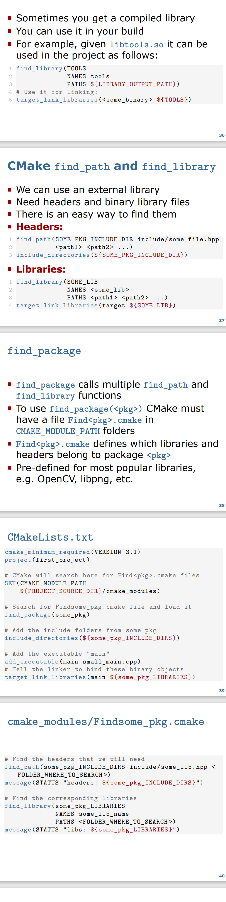

# Lec1 - Modern C++: Build and Tools

- [Lec1 - Modern C++: Build and Tools](#lec1---modern-c-build-and-tools)
  - [C++ Dev Tools](#c-dev-tools)
  - [Compiler \& The Compilation Process](#compiler--the-compilation-process)
  - [Compilation Flags](#compilation-flags)
  - [Libraries](#libraries)
  - [Function Declaration \& Definition](#function-declaration--definition)
  - [Linking](#linking)
  - [Link modules and Libraries](#link-modules-and-libraries)
  - [Build System](#build-system)
  - [CMake Intro](#cmake-intro)
  - [CMake Usage](#cmake-usage)
  - [Use pre-compiled library](#use-pre-compiled-library)

## C++ Dev Tools

工程构建过程需要使用多个工具，其中包括：

- 文本编辑器
- Linters
- 测试工具
- 静态代码分析
- 格式调整工具
- CI/CD
- 版本控制工具 Git
- 调试器
- 打包工具
- OS
- 构建系统(Build System)
- Toolchain 工具链

## Compiler & The Compilation Process

那么在 C++ 的众多开发工具中，最重要的便是 C++ 编译器。什么是编译？编译的过程就是将一段高级语言的代码转化为机器可以理解的二进制目标代码的过程。在本课程中，我们使用`clang`进行编译。编译的基础语法如下：

```bash
clang++ main.cpp -o main
```

然后使用`./main`来运行生成的可执行文件。

编译的过程分为 4 个步骤，分别是：

1. 预处理：在程序的头文件中，我们使用`#include`语句来调用 C++ 库函数。 C++ 预处理器的功能在于将引用的头文件复制到源代码的开始处。然后交给编译程序。在使用`clang`进行编译时，我们是输入`clang++ -E main.cpp > main.i`进行预处理，生成的`main.i`即为预处理文件；
2. 编译：编译的过程是将预处理后的源代码转化为汇编程序。语句是`clang++ -S main.i > main.s`；
3. 汇编：汇编的过程是将汇编程序转化为机器能理解的二进制目标文件，语句是`clang++ -c main.s`，这里不需要`> main.o`是因为默认生成`main.o`；
4. 链接：编译的最后一步是链接，链接的作用是将生成的`main.o`与其他所需的目标文件链接起来，生成一个`main`可执行文件。使用的语句是`clang++ main.o -o main`;

## Compilation Flags

在编译的过程中，我们可以附加一些`flag`，来满足我们的一些额外的需求，譬如：

- `-O[编译优化等级]`： `-O0`是不进行编译优化，`-O3`或者`-Ofast`是进行最高级别的代码优化。
- `-Wall`是打印编译警告，`-Werror`是将编译的警告当成错误，`-Wextra`是打印一些额外的警告信息
- `-std=c++17`是使用`C++ 17`版本
- `-g`是附带调试信息，便于用`gdb`或其他调试器进行调试

## Libraries

程序员在编写 C++ 程序的过程中，可以调用一些 C++ 标准库或其他库中的程序，以防重复造轮子。库是一套目标文件的集合，为程序员提供了一些可用的编程接口。我们只需要在头文件中写入`#include <xxx>`即可调用。而 C++ 库分为两类：静态链接库和动态链接库。其区别在于：

- 静态链接库：运行起来更快，内容被直接放在生成的二进制可执行文件末尾，但是程序会更大，通常命名为`lib*.a`。使用语句`ar rcs libname.a module.o module.o …`进行构建，其中`module.o`为那些引用的目标文件名，`libname.a`为生成的静态链接库；
- 动态链接库：使用软链接的方式进行引用，通常命名为`lib*.so`；

## Function Declaration & Definition

假如我们要在`main.cpp`中调用一个函数，我们必须先声明它，然后再定义它。声明的作用是告诉编译器，这个函数虽然你现在在这里看不到它的实现，但是它是存在的，告诉编译器放心。而后编译器在链接的时候会去找到函数的实现，如果没有找到，便会报链接错误。你可能会疑惑，为什么不是编译错误，而是链接错误？是因为编译器默认这个函数如果在这里找不到，可能在链接期间会在其他目标文件中找到。
虽然我们可以将函数的声明和函数的定义放在一起，但是这样会导致在工程较大的时候，程序会变得很长，而且文件之间互相引用起来会非常麻烦。此外，函数的实现会直接暴露在外，这样不利于进行函数的封装。因此我们通常将函数的声明和定义分开，将声明放在`.h`文件中，将定义放在`.cpp`文件中。在程序员调用一个库中的函数时，她只会看到函数的接口，而不会看到函数的实现。

## Linking

通常来说， C++ 的工程文件较大，不可能只有一个小的`main.cpp`，还需要引用其他的头文件和库函数。C++ 引用的库，是包含所需函数实现的目标文件。链接实现了函数的声明和函数定义的映射，而部分我们所调用的函数，都在库文件中。要通过链接的方式使用一个库，我们需要两样：

1. 在头文件中引入库，`#include <library_api.h>`
2. 编译好的库目标文件，`library_api.a`

## Link modules and Libraries

C++ 中库的创建和链接过程如下：

1. 编译模块: `clang++ -std=c++17 modules.cpp -c modules.o`
2. 将模块封装为库: `ar rcs tools.a modules.o <other>.o ...`
3. 在编译时链接库：`clang++ -std=c++17  main.cpp -L . -ltools -o main`，其中`-L .`是指在这个目录下找到库，`-ltools`是指链接`tools.a`
4. 运行程序: `./main`

## Build System

通过上述过程我们可以看到，如果手动一步步的手动输入这些命令，整个过程会非常繁琐。而且当工程较大时，对文件一个个手动编译会非常麻烦。那么怎么办呢？我们可以构建一套编译的脚本实现整个工程的编译过程。`make`和`ninja`便是一套构建工具，利用他们可以实现工程编译过程的自动化。以`make`为例，我们在`makefile`中输入编译规则，然后`make`会根据编译规则为我们实现编译过程。

## CMake Intro

有的时候，我们可以使用`CMake`结合`make`来实现工程文件构建。`CMake`不能算构建系统，而是一个构建系统生成器（`Meta System`）。通过`CMake`，我么可以将原来的如下编译过程：

```bash
c++ -std=c++17 -c tools.cpp -o tools.o
ar rcs libtools.a tools.o <other_modules>
c++ -std=c++17 main.cpp -L . -ltools

```

替换为:

```cmake
add_library(tools tools.cpp)
add_executable(main main.cpp)
target_link_libraries(main tools)
```

## CMake Usage

在使用`cmake`前，我们需要在`CMakeLists.txt`中输入相关的指令，例如：

```cmake
cmake_minimum_required(VERSION 3.1) # Mandatory.
project( first_project ) # Mandatory.
set( CMAKE_CXX_STANDARD 17) # Use c++17.

# tell cmake where to look for *.hpp, *.h files
include_directories(include /)

# create library "libtools"
add_library(tools src/tools.cpp) # creates libtools.a

# add executable main
add_executable(main src/ tools_main .cpp) # main.o

# tell the linker to bind these objects together
target_link_libraries(main tools) # ./main
```

使用`cmake`分为如下几个步骤：

```bash
cd <project_folder>
mkdir build
cd build
cmake ..
make
```

如果想要重新构建，只需要：

```bash
cd <project_folder>
rm -rf build/
```

或者：

```bash
cd project/build
make clean
rm -rf *
```

## Use pre-compiled library


