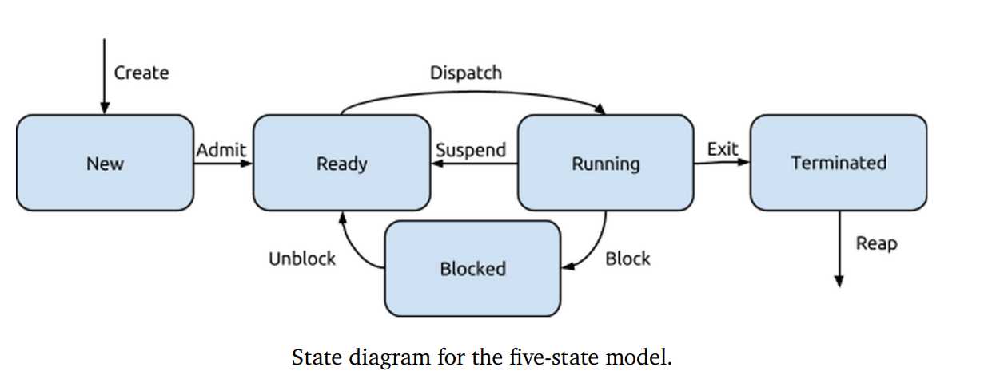

# Thread

## Components

1. Thread execution state (like process state: running, ready, blocked...).
2. Saved thread context when not running.
3. Execution stack.
4. Local variables.
5. Access to the memory and resources of the process (shared with all threads in that process).

## Thread over Process

- Creation faster
- Terminate & Clean up faster
- less time context switch
- Communication easier
- Unblock

## Applications

- Foreground & Background work
- Asynchronized Processing
- Speed of Execution
- Modular Structure

## Problems

- Concurrency
- One thread termination affects other threads

## Thread State

## POSIX API

# Concurrency & Atomicity

# Semaphores

# Synchronization Patterns

# Synchronization Problems

# Deadlock

# Condition Variable

# Advanced Synchronization Problems
